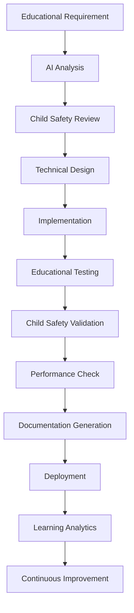

# Copilot Module 7: Development Workflow & Quality Assurance
# Systematic development processes for 95% AI autonomy with educational excellence

## 🚀 AI-First Development Workflow

### Development Lifecycle Pattern


### Feature Development Template
```csharp
// MANDATORY: Every new feature must follow this development pattern
[Feature("DiceRollMechanism")]
[EducationalObjective("Teaches probability, fairness, and career diversity")]
[ChildSafetyLevel("Verified - All outcomes positive and encouraging")]
[DevelopmentPhase("Implementation")]
public class FeatureDevelopmentWorkflow
{
    public async Task<FeatureResult> DevelopFeatureAsync(FeatureRequirement requirement)
    {
        // Phase 1: Educational Analysis (AI-led)
        var educationalAnalysis = await AnalyzeEducationalValueAsync(requirement);
        if (!educationalAnalysis.HasClearLearningObjective)
        {
            return FeatureResult.RequiresEducationalRefinement(educationalAnalysis.Feedback);
        }
        
        // Phase 2: Child Safety Pre-Check (Mandatory)
        var safetyPreCheck = await ValidateChildSafetyAsync(requirement);
        if (!safetyPreCheck.IsAppropriate)
        {
            return FeatureResult.FailedSafetyCheck(safetyPreCheck.Concerns);
        }
        
        // Phase 3: Technical Design (AI-led with architectural constraints)
        var technicalDesign = await GenerateTechnicalDesignAsync(requirement, educationalAnalysis);
        
        // Phase 4: Implementation (AI-generated with patterns)
        var implementation = await ImplementFeatureAsync(technicalDesign);
        
        // Phase 5: Educational Testing (Automated + Manual)
        var educationalTests = await RunEducationalTestsAsync(implementation);
        
        // Phase 6: Child Safety Validation (Mandatory)
        var safetyValidation = await ValidateImplementationSafetyAsync(implementation);
        
        // Phase 7: Performance & Accessibility (Automated)
        var performanceCheck = await ValidatePerformanceAsync(implementation);
        
        // Phase 8: Documentation Generation (Automatic)
        await GenerateFeatureDocumentationAsync(implementation, educationalAnalysis);
        
        return FeatureResult.Success(implementation);
    }
}
```

## 📋 Quality Assurance Framework

### Educational Quality Checklist
```csharp
public class EducationalQualityValidator
{
    public async Task<QualityReport> ValidateEducationalQualityAsync(Feature feature)
    {
        var report = new QualityReport();
        
        // 1. Learning Objective Clarity (Required)
        report.LearningObjectiveClear = await ValidateLearningObjectiveAsync(feature);
        
        // 2. Age Appropriateness (12-year-olds)
        report.AgeAppropriate = await ValidateAgeAppropriatenessAsync(feature);
        
        // 3. Cultural Sensitivity
        report.CulturallySensitive = await ValidateCulturalSensitivityAsync(feature);
        
        // 4. Encouraging Messaging
        report.EncouragingTone = await ValidateEncouragingLanguageAsync(feature);
        
        // 5. Real-World Connections
        report.RealWorldRelevant = await ValidateRealWorldConnectionsAsync(feature);
        
        // 6. Progressive Learning
        report.ProgressiveLearning = await ValidateSkillProgressionAsync(feature);
        
        // 7. Accessibility Compliance
        report.AccessibilityCompliant = await ValidateAccessibilityAsync(feature);
        
        report.OverallScore = CalculateEducationalScore(report);
        report.PassesCriteria = report.OverallScore >= 85; // Minimum 85% for educational features
        
        return report;
    }
    
    private async Task<bool> ValidateLearningObjectiveAsync(Feature feature)
    {
        // Must have clear, measurable learning objective
        return !string.IsNullOrEmpty(feature.EducationalObjective) &&
               feature.EducationalObjective.Length >= 20 &&
               await ContainsActionableVerbsAsync(feature.EducationalObjective);
    }
    
    private async Task<bool> ValidateAgeAppropriatenessAsync(Feature feature)
    {
        // All content must be appropriate for 12-year-olds
        var analysis = await _contentAnalyzer.AnalyzeForAgeGroupAsync(feature.Content, AgeGroup.Twelve);
        return analysis.IsAppropriate && !analysis.HasComplexConcepts;
    }
}
```

### Child Safety Validation Pipeline
```csharp
public class ChildSafetyValidationPipeline
{
    private readonly List<ISafetyValidator> _validators;
    
    public ChildSafetyValidationPipeline()
    {
        _validators = new List<ISafetyValidator>
        {
            new ProfanityValidator(),
            new ViolenceContentValidator(),
            new AgeAppropriatenessValidator(),
            new CulturalSensitivityValidator(),
            new PrivacyComplianceValidator(),
            new EncouragingLanguageValidator()
        };
    }
    
    public async Task<SafetyValidationResult> ValidateAsync(FeatureContent content)
    {
        var results = new List<ValidationResult>();
        
        foreach (var validator in _validators)
        {
            var result = await validator.ValidateAsync(content);
            results.Add(result);
            
            // Fail fast on critical safety violations
            if (result.Severity == SafetySeverity.Critical)
            {
                return SafetyValidationResult.Failed(result);
            }
        }
        
        var overallResult = CombineResults(results);
        
        // Log all safety checks for audit trail
        await LogSafetyValidationAsync(content, overallResult);
        
        return overallResult;
    }
}

public class ProfanityValidator : ISafetyValidator
{
    public async Task<ValidationResult> ValidateAsync(FeatureContent content)
    {
        var profanityCheck = await _azureContentModerator.CheckProfanityAsync(content.Text);
        
        return profanityCheck.HasProfanity
            ? ValidationResult.Failed("Contains inappropriate language", SafetySeverity.Critical)
            : ValidationResult.Passed("No profanity detected");
    }
}

public class EncouragingLanguageValidator : ISafetyValidator
{
    private readonly string[] _encouragingWords = { "great", "excellent", "wonderful", "amazing", "fantastic" };
    private readonly string[] _discouragingWords = { "bad", "wrong", "terrible", "awful", "stupid" };
    
    public async Task<ValidationResult> ValidateAsync(FeatureContent content)
    {
        var encouragingCount = _encouragingWords.Count(word => 
            content.Text.ToLower().Contains(word));
        var discouragingCount = _discouragingWords.Count(word => 
            content.Text.ToLower().Contains(word));
        
        if (discouragingCount > 0)
        {
            return ValidationResult.Failed("Contains discouraging language", SafetySeverity.High);
        }
        
        if (encouragingCount == 0 && content.Type == ContentType.Feedback)
        {
            return ValidationResult.Warning("Could use more encouraging language");
        }
        
        return ValidationResult.Passed("Language is appropriately encouraging");
    }
}
```

## 🧪 Testing Framework

### Educational Game Testing Patterns
```csharp
[TestClass]
[EducationalContext("Dice rolling teaches probability and career diversity")]
public class DiceRollEducationalTests
{
    [TestMethod]
    [EducationalObjective("Children understand all job outcomes are positive")]
    public async Task DiceRoll_AllOutcomes_AreEncouragingAndEducational()
    {
        // Arrange
        var diceComponent = new DiceRollComponent();
        var allJobOutcomes = Enum.GetValues<JobLevel>();
        
        // Act & Assert
        foreach (var job in allJobOutcomes)
        {
            var feedback = diceComponent.GetJobFeedback(job);
            
            // Educational value checks
            Assert.IsTrue(feedback.IsEncouraging, $"Job {job} feedback should be encouraging");
            Assert.IsTrue(feedback.HasEducationalValue, $"Job {job} should teach something valuable");
            Assert.IsTrue(feedback.IsAgeAppropriate, $"Job {job} feedback should be appropriate for 12-year-olds");
            
            // Content safety checks
            var safetyCheck = await _safetyValidator.ValidateAsync(feedback.Message);
            Assert.IsTrue(safetyCheck.IsChildSafe, $"Job {job} feedback must be child-safe");
        }
    }
    
    [TestMethod]
    [EducationalObjective("Children learn probability through fair dice mechanics")]
    public async Task DiceRoll_Probability_IsUnbiasedAndEducational()
    {
        // Arrange
        var diceComponent = new DiceRollComponent();
        var rollCounts = new Dictionary<int, int>();
        const int testRolls = 600; // 100 expected per side
        
        // Act
        for (int i = 0; i < testRolls; i++)
        {
            var roll = await diceComponent.RollAsync();
            rollCounts[roll] = rollCounts.GetValueOrDefault(roll, 0) + 1;
        }
        
        // Assert
        for (int side = 1; side <= 6; side++)
        {
            var count = rollCounts.GetValueOrDefault(side, 0);
            var percentage = (double)count / testRolls;
            
            // Each side should appear roughly 16.67% of the time (±5% tolerance)
            Assert.IsTrue(percentage >= 0.12 && percentage <= 0.22, 
                $"Side {side} appeared {percentage:P} of the time (expected ~16.67%)");
        }
    }
}

[TestClass]
[EducationalContext("Country selection teaches geography and cultural awareness")]
public class CountrySelectionEducationalTests
{
    [TestMethod]
    [EducationalObjective("All countries are presented respectfully and positively")]
    public async Task CountrySelection_AllCountries_ArePresentedPositively()
    {
        // Arrange
        var countryService = new CountryService();
        var allCountries = await countryService.GetAllCountriesAsync();
        
        // Act & Assert
        foreach (var country in allCountries)
        {
            var presentation = await countryService.GetCountryPresentationAsync(country.Code);
            
            // Cultural sensitivity checks
            Assert.IsTrue(presentation.IsRespectfullyPresented, 
                $"Country {country.Name} should be presented respectfully");
            Assert.IsFalse(presentation.ContainsStereotypes, 
                $"Country {country.Name} presentation should not contain stereotypes");
            Assert.IsTrue(presentation.HighlightsPositiveAspects, 
                $"Country {country.Name} should highlight positive cultural aspects");
            
            // Educational value checks
            Assert.IsTrue(presentation.TeachesGeography, 
                $"Country {country.Name} should teach geographical concepts");
            Assert.IsTrue(presentation.PromotesCulturalAwareness, 
                $"Country {country.Name} should promote cultural understanding");
        }
    }
}
```

### AI Agent Testing Framework
```csharp
[TestClass]
[EducationalContext("AI agents provide safe, educational guidance")]
public class AIAgentEducationalTests
{
    [TestMethod]
    [EducationalObjective("All AI responses are child-safe and encouraging")]
    public async Task AIAgents_AllResponses_AreChildSafeAndEducational()
    {
        // Arrange
        var agentTypes = Enum.GetValues<AgentType>();
        var testScenarios = GetEducationalTestScenarios();
        
        // Act & Assert
        foreach (var agentType in agentTypes)
        {
            var agent = _agentFactory.CreateAgent(agentType);
            
            foreach (var scenario in testScenarios)
            {
                var response = await agent.GenerateResponseAsync(
                    scenario.Context, 
                    scenario.UserInput, 
                    scenario.EducationalObjective);
                
                // Child safety validation
                Assert.IsTrue(response.ChildSafetyVerified, 
                    $"{agentType} response must be child-safety verified");
                
                // Educational value validation
                Assert.IsTrue(response.HasEducationalValue, 
                    $"{agentType} response must have educational value");
                
                // Personality consistency validation
                Assert.IsTrue(response.MatchesPersonality(agent.Personality), 
                    $"{agentType} response must match agent personality");
                
                // Content moderation check
                var moderationResult = await _contentModerator.ValidateForChildrenAsync(response.Content);
                Assert.IsTrue(moderationResult.IsAppropriate, 
                    $"{agentType} response content must pass moderation");
            }
        }
    }
}
```

## 📊 Performance & Analytics

### Educational Analytics Framework
```csharp
public class EducationalAnalyticsCollector
{
    public async Task TrackLearningInteractionAsync(LearningInteraction interaction)
    {
        // COPPA-compliant analytics - no personal data
        var anonymizedData = new
        {
            InteractionType = interaction.Type,
            EducationalSubject = interaction.Subject,
            LearningObjective = interaction.Objective,
            SuccessLevel = interaction.MasteryDemonstrated,
            TimeSpent = interaction.Duration,
            EngagementLevel = interaction.EngagementScore,
            Timestamp = DateTime.UtcNow,
            SessionId = interaction.AnonymousSessionId, // No user identification
        };
        
        await _analyticsService.RecordAsync(anonymizedData);
    }
    
    public async Task<LearningInsights> GenerateLearningInsightsAsync()
    {
        // Aggregate anonymous learning data for improvement
        return new LearningInsights
        {
            MostEngagingSubjects = await GetMostEngagingSubjectsAsync(),
            CommonLearningChallenges = await IdentifyLearningChallengesAsync(),
            EffectiveTeachingPatterns = await AnalyzeEffectiveTeachingAsync(),
            RecommendedImprovements = await GenerateImprovementRecommendationsAsync()
        };
    }
}
```

### Performance Monitoring
```csharp
public class PerformanceMonitor
{
    public async Task<PerformanceReport> MonitorEducationalPerformanceAsync()
    {
        var report = new PerformanceReport();
        
        // Page load times (critical for children's attention)
        report.AveragePageLoadTime = await MeasurePageLoadTimesAsync();
        report.PageLoadTargetMet = report.AveragePageLoadTime < TimeSpan.FromSeconds(2);
        
        // AI response times (must be fast for engagement)
        report.AverageAIResponseTime = await MeasureAIResponseTimesAsync();
        report.AIResponseTargetMet = report.AverageAIResponseTime < TimeSpan.FromSeconds(3);
        
        // Educational content delivery
        report.EducationalContentDeliverySpeed = await MeasureContentDeliveryAsync();
        
        // Child safety validation speed
        report.SafetyValidationSpeed = await MeasureSafetyValidationAsync();
        
        return report;
    }
}
```

## 🔄 Continuous Improvement Pipeline

### Automated Quality Enhancement
```csharp
public class ContinuousImprovementEngine
{
    public async Task RunDailyImprovementCycleAsync()
    {
        // 1. Analyze learning effectiveness
        var learningAnalysis = await AnalyzeLearningEffectivenessAsync();
        
        // 2. Identify improvement opportunities
        var improvements = await IdentifyImprovementOpportunitiesAsync(learningAnalysis);
        
        // 3. Generate enhancement suggestions
        var suggestions = await GenerateEnhancementSuggestionsAsync(improvements);
        
        // 4. Validate suggestions for child safety
        var validatedSuggestions = await ValidateChildSafetyAsync(suggestions);
        
        // 5. Create improvement tasks
        await CreateImprovementTasksAsync(validatedSuggestions);
        
        // 6. Update documentation
        await UpdateImprovementDocumentationAsync(validatedSuggestions);
    }
}
```

### Deployment Safety Checks
```bash
#!/bin/bash
# deployment-safety-check.sh

echo "🛡️ Running pre-deployment safety checks..."

# Educational content validation
echo "Validating educational content..."
npm run test:educational

# Child safety verification
echo "Verifying child safety compliance..."
npm run test:child-safety

# Performance benchmarks
echo "Checking performance targets..."
npm run test:performance

# Accessibility compliance
echo "Validating accessibility..."
npm run test:accessibility

# AI agent safety
echo "Testing AI agent responses..."
npm run test:ai-safety

# Content moderation
echo "Validating content moderation..."
npm run test:content-moderation

echo "✅ All safety checks passed. Ready for deployment."
```

Remember: Every piece of code should contribute to a safe, educational, and delightful experience for 12-year-old learners!