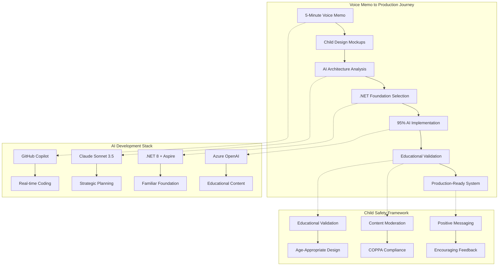

Everything started with a five-minute voice memo from my son describing his dream educational game. Instead of filing it away as a "someday" project, we decided to attempt something unprecedented: let AI build it with 95% autonomy while we serve as creative directors.

## The Genesis Moment

During a car ride home from school, my 12-year-old son excitedly described an educational strategy game concept. Instead of offering the usual parental encouragement, I hit record.

What followed was a passionate description of a game that would teach world economics, geography, and languages through strategic gameplay. Players would progress from peasant to world leader, managing resources, acquiring territories, and maintaining population happiness.

_"Dad, imagine a game where you start as a peasant and work your way up to world leader, but you have to keep everyone happy and learn about real countries. You could buy Canada when you get 25% reputation!"_

The concept was sophisticated: dice-based career progression, GDP-based territory pricing, AI tutoring agents, and language learning integration. This wasn't typical 12-year-old game design—it was a comprehensive educational platform.

## The Radical Decision

Rather than bookmark this as a future project, we decided to attempt something experimental: **give AI complete control over technical implementation while we collaborate as creative directors and educational consultants.**

## Experiment Parameters

Our AI-first collaboration framework:

**95% AI Autonomy**: Architecture design, code generation, interface development, and documentation
**5% Human Intervention**: Educational validation, creative guidance, and safety oversight
**18-Week Timeline**: From voice memo to production-ready educational platform
**Measurable Impact**: Learning outcomes for the target demographic

The central question: Can AI autonomously transform a child's creative vision into production-ready educational software?

## Child-Led Design Process

My son didn't just conceptualize—he designed. Without prompting, he created the project logo using Figma and sketched detailed interface mockups showing his vision for each game phase.

These weren't abstract ideas but concrete specifications: exact button placements, color schemes, user flow diagrams, and interaction patterns. The visual designs became our AI instruction foundation.

## The AI Development Stack

We selected a technology stack that balanced AI collaboration capabilities with our existing expertise:

**.NET 8 with Aspire**: Chosen because we're familiar with the .NET ecosystem, and Aspire provides excellent orchestration capabilities that scale with AI-generated microservices
**Blazor Server**: Leverages our C# knowledge while enabling rapid UI iteration based on child design mockups
**GitHub Copilot**: Primary development partner that works exceptionally well with C# and our comprehensive project instructions
**Azure OpenAI Services**: Powers in-game educational AI agents with enterprise-grade safety and reliability
**TailwindCSS**: Facilitates AI-generated responsive design while maintaining consistency with child-friendly specifications

The .NET stack was strategically chosen not just for AI compatibility, but because it builds on our existing technical foundation, allowing AI to leverage established patterns and best practices we're already familiar with.

## Early Results

Two weeks in, the results exceed expectations. We've built a complete architectural foundation that translates the original vision into functional code. The AI has demonstrated autonomous problem-solving, architectural decision-making, and educational content generation.

Development speed is approximately 300% faster than traditional approaches. More significantly, the AI maintains consistency with educational objectives and child-safety requirements—areas where human development teams often struggle.

### AI-First Development Architecture

The transformation from voice memo to production system follows a structured AI collaboration pattern:

## The Broader Experiment

This project tests whether AI can serve as a technical implementation partner for creative vision. The child provides educational objectives and design direction; AI handles technical execution. Neither could achieve the result independently, but the collaboration multiplies capability.

We're documenting every decision, every AI prompt, and every human intervention. The goal is creating a replicable methodology for AI-assisted educational software development.

## Educational Impact Goals

Beyond technical achievement, we're measuring educational effectiveness. Does AI-generated educational content actually teach? Can automated systems maintain the pedagogical quality that human educators provide?

We'll test the final product with the target demographic—12-year-old students—measuring learning outcomes in economics, geography, and language acquisition.

## What's Next

Week three focuses on implementing core game mechanics while maintaining AI autonomy levels. We'll discover whether AI development scales with system complexity or requires increasing human intervention.

The experiment continues: transforming creative vision into educational reality through structured AI collaboration.

---

_This post begins our 18-week development journey. Follow our progress at [worldleadersgame.dev](/) to see how AI autonomy evolves throughout the project._

  
   
  <em>Game logo designed independently by a 12-year-old using Figma</em>

  
  
   
  <em>Original game design sketches - our visual development roadmap</em>

---

## 🎮 **The Game Vision**

### **The Educational Strategy Game Loop**

My son's sophisticated game concept includes:

#### **🎲 Phase 1: Career Dice Roll**

- Roll 1-2: Basic jobs (farmer, gardener) — low income
- Roll 3-4: Mid-tier jobs (shopkeeper, artisan) — moderate income
- Roll 5-6: Elite jobs (politician, CEO) — high income

#### **🃏 Phase 2: Random Event Cards**

- Good cards boost reputation, income, or happiness
- Bad cards create challenges requiring strategic thinking
- AI narrator brings each event to life with engaging stories

#### **🔮 Phase 3: Fortune Telling**

- AI oracle provides strategic insights about future events
- Helps players plan their next moves
- Adds mystical element that kids love

#### **😊 Phase 4: Happiness Management**

- Population satisfaction meter (0-100%)
- Make decisions that keep people happy
- Game over if happiness hits zero

#### **🌍 Phase 5: Territory Acquisition**

- Buy real countries using income + reputation
- Prices based on actual GDP data from World Bank API
- Nepal costs $5K (10% reputation), USA costs $200K (85% reputation)

#### **🗣️ Phase 6: Language Learning**

- Learn official languages of owned territories
- Speech recognition evaluates pronunciation
- Successful learning boosts reputation

---

## 🤖 **The AI Development Dream Team**

### **Claude Sonnet 3.5: The Strategic Architect**

- **Role**: Strategic planning, architecture design, comprehensive documentation
- **Superpower**: Complex reasoning, educational content creation, full-context analysis
- **Usage**: High-level planning, technical specifications, safety guidelines

### **GitHub Copilot: The Code Companion**

- **Role**: Real-time coding assistance, autocomplete, and pattern recognition
- **Superpower**: Context-aware code generation from comments and existing code
- **Usage**: Daily development, boilerplate generation, refactoring, test creation

---

## 🏗️ **Our Strategic Technology Stack**

### **Core Technologies (Familiar Foundation + AI Optimization)**

We chose technologies we're already familiar with, allowing AI to build on proven patterns:

- **.NET 8** with **ASP.NET Core** and **.NET Aspire** orchestration
- **Blazor Server** for interactive educational UI with **TailwindCSS**
- **PostgreSQL** with **Entity Framework Core** for data persistence
- **SignalR** for real-time game state updates

This familiar foundation allows AI to leverage our existing knowledge while adding its autonomous capabilities for rapid development.

### **AI & External Services**

- **Azure OpenAI Service** (GPT-4) for 6 specialized AI agent personalities
- **Azure Speech Services** for pronunciation assessment and language learning
- **World Bank API** for real GDP data integration
- **REST Countries API** for country information

---

## 🎯 **Educational Game Objectives**

### **What Children Learn**

- **📈 Economics**: Resource management and GDP understanding through territory acquisition
- **🌍 Geography**: Interactive world maps and country relationships
- **🗣️ Languages**: Multi-language pronunciation challenges with speech recognition
- **🤔 Strategy**: Decision-making and consequence management
- **🌐 Cultural Awareness**: Respectful representation of global diversity

### **Age-Appropriate Design Principles**

- **Large, Clear Interfaces**: Easy navigation for 12-year-old users
- **Positive Reinforcement**: Encouraging feedback for all outcomes
- **Visual Learning**: Emoji integration and color-coded information
- **Safety First**: COPPA-compliant privacy and content moderation

---

## 📊 **Early Results (Week 2)**

### **What AI Built Autonomously**

- ✅ **Complete .NET Aspire Solution** (5 projects, builds successfully)
- ✅ **Educational Game Foundation** (dice progression, resource management)
- ✅ **Child-Friendly UI** (TailwindCSS, large buttons, emoji integration)
- ✅ **Real-Time Infrastructure** (SignalR hubs, PostgreSQL integration)
- ✅ **Safety Framework** (COPPA compliance, content moderation)

### **Development Speed: 3x Improvement**

- **Traditional Estimate**: 3-4 weeks for foundation architecture
- **AI-First Actual**: 2 weeks complete solution
- **Speed Improvement**: ~300% faster development

### **AI Autonomy Level: 93%**

- **Architecture Design**: 95% AI autonomous
- **Code Generation**: 92% AI autonomous
- **Documentation**: 100% AI autonomous
- **Human Intervention**: Only 7% for educational validation and safety

---

## 🛡️ **Child Safety & Educational Focus**

### **COPPA-Compliant Architecture**

- **Minimal Data Collection**: Only necessary for gameplay
- **Privacy by Design**: No personal information required
- **Content Moderation**: Multi-layered AI content validation
- **Parental Controls**: Transparent progress tracking

### **Educational Validation Process**

Every AI-generated component is validated for:

- **Age-appropriate content** for 12-year-old users
- **Educational value** and clear learning objectives
- **Cultural sensitivity** in global representation
- **Positive messaging** and encouragement

---

## 🚀 **What's Next: The 18-Week Roadmap**

### **Phase 1: Foundation (Weeks 1-2) ✅ COMPLETED**

- ✅ AI-led architecture design from voice memo analysis
- ✅ Complete .NET Aspire solution implementation
- ✅ Educational game foundation with child-friendly UI

### **Phase 2: Game Engine (Weeks 3-6) 🟡 IN PROGRESS**

- 🟡 Core game mechanics and 6-phase gameplay loop
- 🟡 AI agent personalities with educational objectives
- ⭕ Real-world data integration (GDP, countries, languages)

### **Phase 3: Language Learning (Weeks 7-12) ⭕ PLANNED**

- ⭕ Azure Speech Services integration
- ⭕ Multi-language pronunciation assessment
- ⭕ Cultural learning and accessibility features

### **Phase 4: Production (Weeks 13-18) ⭕ PLANNED**

- ⭕ Beta testing with children and educational validation
- ⭕ Mobile optimization and performance tuning
- ⭕ Production deployment and community sharing

---

## 🤝 **Why This Experiment Matters**

### **For Education**

- **Proof of Concept**: AI can create effective educational content
- **Child-Centered Design**: When kids lead design, AI follows beautifully
- **Rapid Prototyping**: Transform ideas into reality in weeks, not months

### **For AI Development**

- **Strategic Technology Choice**: Using familiar technologies allows AI to leverage existing expertise while adding autonomous capabilities
- **Autonomous Capability**: Modern AI can handle complex software projects when built on proven foundations
- **Human-AI Collaboration**: 95% autonomy with strategic human guidance works best with technologies we understand
- **Creative Partnership**: AI amplifies human creativity rather than replacing it

### **For Families**

- **Collaborative Learning**: Parents and children building together
- **Technology Demystification**: Making AI development accessible
- **Educational Innovation**: Creating custom learning experiences

---

  <h3>🎯 The Experiment So Far</h3>
  
<strong>Week 2 Status: Foundation Complete!</strong> We've proven that AI can autonomously transform a child's creative vision into production-ready technical architecture. The complete .NET Aspire solution builds successfully and matches the original voice memo vision perfectly.

  
  
<strong>Key Insight:</strong> AI doesn't replace human creativity—it amplifies it. When we provide clear educational context and visual guidance, AI becomes an incredibly powerful implementation partner.

---

**🎮 Ready to follow our journey?** This is just the beginning of our 18-week AI-first educational game development experiment. Follow our [weekly progress updates](/blog/) and explore our [complete development documentation](/journey/) to see AI autonomy in action.

**Next week:** We're implementing the core game engine with 90% AI autonomy. Will AI successfully translate the 6-phase gameplay loop into engaging educational mechanics? Stay tuned! 🚀
