# AI-First Development Workflow: From Issue Creation to Pull Request

**How we achieve 95% AI autonomy in educational software development**

In our World Leaders Game project, we've developed a revolutionary AI-first workflow that achieves 95% development autonomy. This post documents our complete process from issue creation to pull request completion using GitHub Copilot and AI agents.

---

## 🎯 Overview: The Complete AI Development Cycle

Our workflow transforms traditional software development by putting AI in the driver's seat while maintaining human oversight for educational validation and creative direction.

```mermaid
graph TD
    A[🎙️ Voice Memo/Idea] --> B{🤖 AI Analysis}
    B -->|Educational Context| C[📋 AI Issue Generation]
    C --> D[📝 GitHub Issue Created]
    D --> E{👨‍💻 Copilot Agent}
    E -->|@github-copilot implement| F[🏗️ Architecture Design]
    F --> G[💻 Code Generation]
    G --> H{🛡️ Safety Pipeline}
    H -->|✅ Pass| I[📄 Auto PR Creation]
    H -->|❌ Fail| J[🔄 Safety Fallback]
    J --> G
    I --> K{👨‍🎓 Human Review}
    K -->|Educational ✅| L[🔀 Merge to Main]
    K -->|Needs Changes| M[🔧 AI Refinement]
    M --> G
    L --> N[📚 Auto Documentation]
    N --> O[🔄 Learning Loop]
    O -->|Feedback| B
    
    %% Styling for different phases
    classDef aiPhase fill:#e3f2fd,stroke:#1976d2,stroke-width:2px
    classDef safetyPhase fill:#fff3e0,stroke:#f57c00,stroke-width:2px
    classDef humanPhase fill:#f3e5f5,stroke:#7b1fa2,stroke-width:2px
    classDef outputPhase fill:#e8f5e8,stroke:#388e3c,stroke-width:2px
    
    class A,B,C,E,F,G,M aiPhase
    class H,J safetyPhase
    class D,K humanPhase
    class I,L,N,O outputPhase
    
    %% Add interaction arrows with labels
    B -.->|"95% AI Autonomy"| E
    K -.->|"5% Human Oversight"| L
    O -.->|"Continuous Improvement"| B
    H -.->|"Multi-layer Validation"| I
```

---

## 📋 Step 1: AI-Powered Issue Generation

### The Process

Instead of manually writing GitHub issues, we use AI to transform high-level concepts into detailed, actionable development tasks.

#### Input: Educational Concept
```
"We need AI agents that can help 12-year-olds learn about different countries 
while playing the game, with different personalities for different subjects."
```

#### AI Processing
We use Claude Sonnet 3.5 to analyze this and generate comprehensive GitHub issues:


#### Generated Issue Structure
```markdown
# AI Agent Personality System for Educational Game

## 🎯 Educational Objective
Create 6 distinct AI agent personalities to guide 12-year-old players through 
geography, economics, and language learning while maintaining child safety.

## 🛡️ Child Safety Requirements
- Multi-layer content validation
- Age-appropriate language patterns
- Safe fallback responses
- COPPA compliance

## 🔧 Technical Implementation
- Azure OpenAI integration
- Personality configuration system
- Content moderation pipeline
- Educational outcome tracking

## ✅ Acceptance Criteria
- [ ] 6 distinct agent personalities implemented
- [ ] Safety validation passes all tests
- [ ] Educational effectiveness measured
- [ ] Child-friendly UI integration

**Estimated Time**: 8 hours
**AI Autonomy**: 90%
```

---

## 🤖 Step 2: GitHub Copilot Agent Workflow

### Agent Handoff Process

Once the issue is created, we use GitHub Copilot's agent system to handle the implementation:

```mermaid
sequenceDiagram
    participant 👨‍💻 as Human Developer
    participant 🤖 as GitHub Copilot
    participant 🧠 as Claude AI
    participant 🛡️ as Safety Validator
    participant 📦 as Repository
    participant 👨‍🎓 as Educational Reviewer
    
    Note over 👨‍💻,📦: 95% AI Autonomy Workflow
    
    👨‍💻->>🤖: @copilot implement issue #32
    🤖->>🧠: Analyze educational requirements
    🧠-->>🤖: Educational context + safety needs
    
    loop Code Generation Cycle
        🤖->>📦: Generate feature branch
        🤖->>📦: Create initial implementation
        🤖->>🛡️: Validate child safety
        alt Safety Check Passes
            🛡️-->>🤖: ✅ Content approved
        else Safety Check Fails
            🛡️-->>🤖: ❌ Apply fallback
            🤖->>🤖: Regenerate with safety constraints
        end
    end
    
    🤖->>📦: Create comprehensive PR
    📦->>👨‍🎓: Notify for educational review
    
    Note over 👨‍🎓: 5% Human Oversight
    alt Educational Review Passes
        👨‍🎓->>📦: ✅ Approve & merge
        📦->>🤖: Trigger documentation update
    else Needs Educational Refinement
        👨‍🎓->>🤖: 🔄 Request changes
        🤖->>🤖: Refine with educational feedback
    end
    
    📦->>🧠: Send outcome data for learning
    🧠-->>🤖: Update patterns for next iteration
```



### Copilot Agent Commands

Here's how we interact with the Copilot agent:

#### 1. Issue Assignment
```bash
@github-copilot implement issue #32 "AI Agent Personality System"
```

#### 2. Educational Context Injection
```bash
@github-copilot remember this is for 12-year-old learners, ensure all content 
is age-appropriate and educationally valuable
```

#### 3. Safety-First Development
```bash
@github-copilot prioritize child safety - implement content validation for 
all AI responses
```

### AI Prompt Interface in Action

Here's what the GitHub Copilot agent interaction looks like in practice:


*Live demonstration of our AI-first development workflow using GitHub Copilot agents for educational game development with child safety validation.*

---

## 💻 Step 3: AI Code Generation Process

### Architecture-First Approach

The AI agent starts by creating the educational framework:


### Generated Code Structure

The AI creates a complete implementation following our educational patterns:

```csharp
// Context: Educational AI agent for 12-year-old geography learning
// Educational Objective: Teach country recognition and cultural awareness
// Safety Requirements: Age-appropriate content, positive messaging

public class EducationalAIAgent : IAIAgent
{
    private readonly IAIService _aiService;
    private readonly IContentModerationService _contentModerator;
    private readonly IEducationalValidator _educationalValidator;

    public async Task<AgentResponse> GenerateResponseAsync(
        GameContext context, string userInput)
    {
        // Multi-layer safety validation
        var response = await _aiService.GenerateEducationalResponseAsync(
            Type, context, userInput, EducationalFocus);
        
        var safetyResult = await ValidateResponseSafetyAsync(response.Content);
        
        return safetyResult.IsValid 
            ? response 
            : GetSafeFallbackResponse();
    }
}
```

---

## 🔍 Step 4: Educational Safety Validation

### Automated Safety Pipeline

Every AI-generated feature goes through our comprehensive safety validation:

```mermaid
flowchart TD
    Start([🤖 AI Generated Code]) --> ContentMod{🔍 Content Moderation}
    ContentMod -->|✅ Clean| AgeCheck{👶 Age Appropriateness}
    ContentMod -->|❌ Flagged| Block1[🚫 Block & Generate Fallback]
    
    AgeCheck -->|✅ 12yr+ Suitable| EduValue{📚 Educational Value}
    AgeCheck -->|❌ Too Complex/Simple| Block2[🔄 Adjust Reading Level]
    
    EduValue -->|✅ High Learning Value| Cultural{🌍 Cultural Sensitivity}
    EduValue -->|❌ Low Educational Worth| Block3[📈 Enhance Learning Content]
    
    Cultural -->|✅ Respectful| Privacy{🔒 Privacy Check}
    Cultural -->|❌ Potentially Offensive| Block4[🛠️ Cultural Refinement]
    
    Privacy -->|✅ COPPA Compliant| Approved([✅ Code Approved])
    Privacy -->|❌ Privacy Risk| Block5[🔐 Privacy Protection]
    
    Block1 --> Regenerate[🔄 AI Regeneration]
    Block2 --> Regenerate
    Block3 --> Regenerate
    Block4 --> Regenerate
    Block5 --> Regenerate
    
    Regenerate --> ContentMod
    
    Approved --> Deploy[🚀 Ready for Testing]
    
    %% Dynamic styling
    classDef checkNode fill:#e3f2fd,stroke:#1976d2,stroke-width:2px
    classDef blockNode fill:#ffebee,stroke:#d32f2f,stroke-width:2px
    classDef approvedNode fill:#e8f5e8,stroke:#388e3c,stroke-width:3px
    classDef processNode fill:#fff3e0,stroke:#f57c00,stroke-width:2px
    
    class ContentMod,AgeCheck,EduValue,Cultural,Privacy checkNode
    class Block1,Block2,Block3,Block4,Block5 blockNode
    class Approved,Deploy approvedNode
    class Start,Regenerate processNode
```



### Safety Validation Code

```csharp
public class ChildSafetyValidator
{
    public async Task<SafetyValidationResult> ValidateAsync(string content)
    {
        var result = new SafetyValidationResult();
        
        // Azure Content Moderator
        result.ContentModerationPassed = await _contentModerator.ValidateAsync(content);
        
        // Age-appropriate language (12-year-olds)
        result.AgeAppropriatenessPassed = await ValidateReadingLevelAsync(content);
        
        // Educational value verification
        result.EducationalValueConfirmed = await AssessLearningValueAsync(content);
        
        // Cultural sensitivity
        result.CulturalSensitivityPassed = await ReviewCulturalContentAsync(content);
        
        return result;
    }
}
```

---

## 📝 Step 5: Automated Pull Request Creation

### AI-Generated Pull Requests

The Copilot agent automatically creates comprehensive pull requests:


### Sample AI-Generated PR

```markdown
## 🤖 AI Agent Personality System Implementation

### 📚 Educational Impact
- **Learning Objective**: Enhanced geography and cultural awareness for 12-year-olds
- **Engagement**: 6 distinct AI personalities provide personalized tutoring
- **Safety**: Multi-layer content validation ensures child-appropriate interactions

### 🛡️ Child Safety Validation
- ✅ Azure Content Moderator integration
- ✅ Age-appropriate language patterns (12-year-old reading level)
- ✅ Cultural sensitivity review passed
- ✅ Safe fallback responses implemented

### 🔧 Technical Implementation
- AI agent personality configuration system
- Real-time content moderation pipeline
- Educational outcome tracking
- Child-friendly UI integration

### 🧪 Testing Strategy
- Unit tests for all safety validators
- Integration tests with educational scenarios
- Child safety compliance verification
- Performance testing for real-time responses

**AI Autonomy**: 92% | **Human Review**: Educational validation required
```

---

## 👥 Step 6: Human Educational Review

### Our 5% Human Oversight

While AI handles 95% of the development, humans focus on critical educational validation:


### Human Review Checklist

```markdown
## Educational Validation Checklist

### 🎯 Learning Objectives
- [ ] Age-appropriate for 12-year-olds
- [ ] Supports curriculum standards
- [ ] Encourages critical thinking
- [ ] Promotes cultural awareness

### 🛡️ Child Safety
- [ ] All content appropriate for target age
- [ ] Privacy protection measures active
- [ ] No inappropriate language or concepts
- [ ] Safe interaction patterns

### 🌍 Educational Value
- [ ] Real-world learning connections
- [ ] Accurate geographic/economic data
- [ ] Positive representation of cultures
- [ ] Measurable learning outcomes
```

---

## 🔄 Step 7: Continuous Learning Loop

### AI Model Improvement

Our workflow includes continuous improvement based on educational outcomes:

```mermaid
graph TD
    subgraph "🎯 Learning Analytics"
        A[👨‍🎓 Educational Outcome Data] --> B[📊 Performance Metrics]
        B --> C[🧠 Pattern Analysis]
    end
    
    subgraph "🤖 AI Model Evolution"
        C --> D[📝 Prompt Refinement]
        D --> E[🎯 Better Code Generation]
        E --> F[📈 Enhanced Educational Value]
    end
    
    subgraph "🔄 Feedback Integration"
        F --> G[👨‍💻 Developer Experience]
        G --> H[👶 Child Learning Outcomes]
        H --> I[🏫 Teacher Feedback]
        I --> A
    end
    
    %% External feedback loops
    J[🎮 Game Usage Data] -.-> A
    K[👨‍👩‍👧‍👦 Parent Feedback] -.-> A
    L[🛡️ Safety Incident Reports] -.-> C
    
    %% Improvement indicators
    F -.->|"Improved Autonomy"| M[📊 95% → 98% AI]
    H -.->|"Better Learning"| N[🎯 Enhanced Engagement]
    
    classDef dataNode fill:#e3f2fd,stroke:#1976d2,stroke-width:2px
    classDef aiNode fill:#e8f5e8,stroke:#388e3c,stroke-width:2px
    classDef feedbackNode fill:#fff3e0,stroke:#f57c00,stroke-width:2px
    classDef outcomeNode fill:#f3e5f5,stroke:#7b1fa2,stroke-width:2px
    
    class A,B,J,K,L dataNode
    class C,D,E aiNode
    class F,G,I feedbackNode
    class H,M,N outcomeNode
```



---

## 📊 Results: 95% AI Autonomy Achieved

### Workflow Metrics

| Stage | AI Autonomy | Human Input | Time Saved |
|-------|-------------|-------------|------------|
| **Issue Creation** | 90% | Educational validation | 80% |
| **Code Generation** | 95% | Architecture review | 85% |
| **Safety Validation** | 85% | Final safety check | 70% |
| **Documentation** | 95% | Educational context | 90% |
| **Testing** | 80% | Educational effectiveness | 75% |

### Traditional vs AI-First Timeline


**Result**: 29 days → 6 days (79% time savings)

---

## 🌟 Key Success Factors

### 1. Educational-First Prompting
Always frame AI requests with educational context:
```
"Create code for 12-year-old learners that teaches [concept] while ensuring 
child safety and age-appropriate content"
```

### 2. Comprehensive Safety Framework
Every AI interaction includes multi-layer validation:
- Content moderation
- Age appropriateness
- Educational value
- Cultural sensitivity

### 3. Continuous Human Oversight
Maintain meaningful human involvement in:
- Educational effectiveness validation
- Creative direction alignment
- Child safety final approval

---

## 🚀 Getting Started with AI-First Development

### Prerequisites
1. **GitHub Copilot** subscription with agent access
2. **Azure OpenAI** service for custom AI agents
3. **Content moderation** service (Azure Cognitive Services)
4. **Educational framework** for validation

### Step-by-Step Implementation

#### 1. Set Up AI Instruction System
Create modular AI instructions following our [Copilot Instructions](https://github.com/victorsaly/WorldLeadersGame/tree/main/.github/copilot-instructions) pattern.

#### 2. Implement Safety Pipeline
```csharp
public class AIFirstWorkflow
{
    public async Task<FeatureResult> ImplementFeatureAsync(string concept)
    {
        var issue = await _aiIssueGenerator.CreateIssueAsync(concept);
        var code = await _copilotAgent.ImplementAsync(issue);
        var validation = await _safetyValidator.ValidateAsync(code);
        var pr = await _prGenerator.CreatePullRequestAsync(code, validation);
        return new FeatureResult(issue, code, validation, pr);
    }
}
```

#### 3. Establish Human Review Gates
- Educational validation checkpoints
- Child safety approval gates
- Creative direction alignment reviews

---

## 📈 Future Enhancements

### Planned Improvements
- **Voice-to-Issue**: Direct voice memo to GitHub issue conversion
- **Educational Metrics**: Automated learning outcome measurement
- **Child Feedback Integration**: Direct student input into development cycle
- **Teacher Dashboard**: Educational progress tracking for instructors

---

## 🤝 Community Impact

This AI-first methodology has applications beyond our educational game:

- **Educational Technology**: Rapid development of child-safe learning tools
- **Content Creation**: Automated educational content with safety validation
- **Accessibility**: AI-assisted inclusive design patterns
- **Curriculum Development**: Automated curriculum-aligned software features

---

## 📞 Try It Yourself

### Resources
- **[Full Workflow Documentation](https://worldleadersgame.co.uk/technical-docs)**
- **[Copilot Instructions Templates](https://github.com/victorsaly/WorldLeadersGame/tree/main/.github/copilot-instructions)**
- **[Safety Validation Framework](https://worldleadersgame.co.uk/technical/ai-safety-and-child-protection)**
- **[Live Development Journey](https://worldleadersgame.co.uk/journey)**

### Get Involved
- 🔍 **[Review Our Issues](https://github.com/victorsaly/WorldLeadersGame/issues)** - See AI-generated development tasks
- 🗣️ **[Join Discussions](https://github.com/victorsaly/WorldLeadersGame/discussions)** - Share your AI development insights
- 📚 **[Adapt Our Methodology](https://worldleadersgame.co.uk)** - Use our patterns for your projects

---

*This post documents our live experiment in AI-first educational software development. Follow our journey at [worldleadersgame.co.uk](https://worldleadersgame.co.uk) as we continue to push the boundaries of human-AI collaboration in educational technology.*
