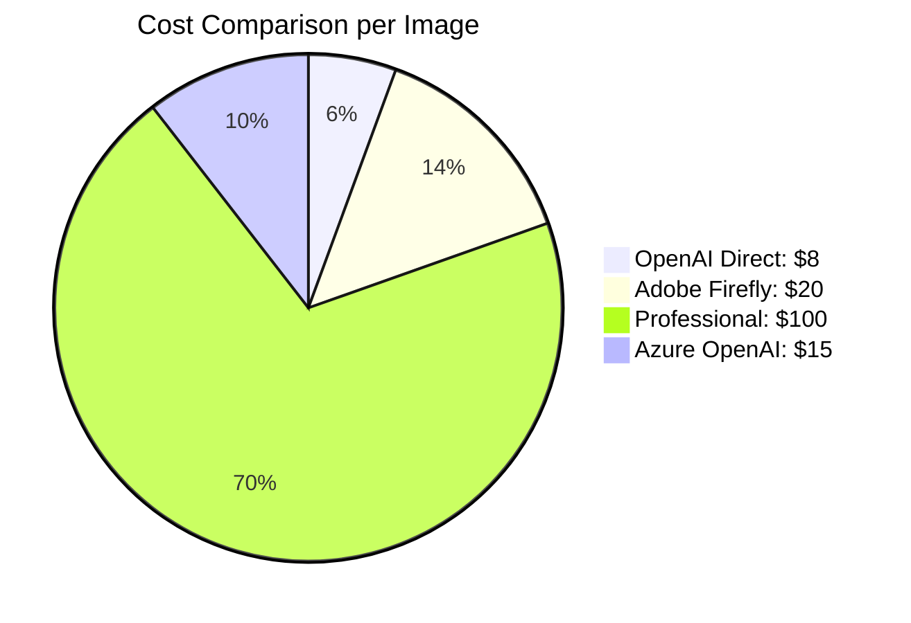

## The Challenge: Professional Marketing Images at Scale

> **TL;DR**: We built a complete automated LinkedIn image generation system using OpenAI DALL-E 3, overcoming Adobe Firefly access restrictions and Azure regional limitations to create 8 professional marketing images for $0.64 total cost.

As our World Leaders Game blog gained traction in the educational technology community, we needed professional LinkedIn images for each blog post. Manual design would be time-consuming and inconsistent. The solution? **AI-powered automated image generation**.

---

## 🎯 The Vision: Automated Professional Marketing

Our goal was ambitious but clear:

- **8 unique LinkedIn images** for existing blog posts
- **Consistent branding** with World Leaders Game educational theme
- **Child-friendly aesthetic** matching our 12-year-old target audience
- **Automated generation** to scale for future posts
- **Cost-effective solution** for indie educational projects

```mermaid
graph TD
    A[📝 Blog Post Content] --> B{🎨 Brand Theme}
    B --> C[🤖 AI Prompt Generation]
    C --> D[🖼️ Image Generation API]
    D --> E[📐 LinkedIn Optimization]
    E --> F[💾 Automated Storage]
    F --> G[📊 Professional Results]

    H[🎨 Design Requirements] --> B
    H --> I[Child-Friendly Colors]
    H --> J[Educational Iconography]
    H --> K[Retro Monochromatic]

    I --> B
    J --> B
    K --> B

    %% Styling
    classDef inputPhase fill:#e3f2fd,stroke:#1976d2,stroke-width:2px
    classDef processPhase fill:#fff3e0,stroke:#f57c00,stroke-width:2px
    classDef outputPhase fill:#e8f5e8,stroke:#388e3c,stroke-width:2px
    classDef designPhase fill:#f3e5f5,stroke:#7b1fa2,stroke-width:2px

    class A,H inputPhase
    class B,C,D,E,F processPhase
    class G outputPhase
    class I,J,K designPhase
```



<details>
<summary>� <strong>Automated LinkedIn Marketing Pipeline</strong> - AI-driven content marketing for educational platforms</summary>
<div class="explanation-content">

**Educational Context**: This Mermaid workflow demonstrates how educational technology projects can automate professional marketing content generation, ensuring consistent brand presentation while focusing development time on learning objectives for 12-year-old users.

**Key Implementation Insights**:
- **Automated Brand Consistency**: Centralized theme management ensures professional presentation across all educational content marketing
- **Multi-Phase Pipeline**: Color-coded phases (input, processing, output, design) show systematic approach to content generation
- **Educational Marketing Focus**: Workflow optimized for educational technology content that builds trust with educators and parents
- **Developer Time Optimization**: Automation allows educational developers to focus on learning objectives rather than marketing design

**Value for Developers**: This pipeline shows how to maintain professional marketing presence for educational platforms without requiring dedicated design resources, essential for small educational technology teams.

</div>
</details>

---

## 🚀 Journey Phase 1: Adobe Firefly - The Premium Attempt

### Initial Approach

We started with **Adobe Firefly**, attracted by its commercial-safe image generation and professional quality.

<details>
<summary>🎨 <strong>Adobe Firefly Integration</strong> - Premium AI image generation for professional educational marketing</summary>
<div class="explanation-content">

**Educational Context**: This Python function demonstrates integration with Adobe Firefly for generating professional marketing images for educational platforms, emphasizing commercial-safe image generation essential for educational technology businesses.

**Key Implementation Insights**:
- **Commercial-Safe Generation**: Adobe Firefly provides legally safe images crucial for educational business marketing without copyright concerns
- **LinkedIn Optimization**: 1792x1024 dimensions specifically optimized for professional networking platform requirements
- **Professional Quality Focus**: High-quality output suitable for educational technology marketing to educators and administrators
- **Enterprise-Grade API**: Standard REST API patterns with Bearer token authentication for professional integration

**Value for Developers**: This approach shows how to integrate premium AI services for educational marketing, though access limitations often require alternative solutions for individual developers.

</div>
</details>

```python
# Initial Adobe Firefly approach
import requests

def generate_firefly_image(prompt, style="professional"):
    """
    Adobe Firefly API integration attempt
    Professional quality, commercial-safe images
    """
    headers = {
        'Authorization': f'Bearer {ADOBE_API_KEY}',
        'Content-Type': 'application/json'
    }

    payload = {
        'prompt': prompt,
        'style': style,
        'size': '1792x1024',  # LinkedIn optimized
        'quality': 'high'
    }

    response = requests.post(ADOBE_FIREFLY_ENDPOINT,
                           headers=headers, json=payload)
    return response.json()
```

### The Roadblock

**Access Restriction**: Adobe Firefly required enterprise-level access not available to individual developers. After multiple attempts and waiting periods, we needed an alternative.

**Lesson Learned**: Premium AI services often have access barriers for indie developers.

---

## ⚡ Journey Phase 2: Azure OpenAI - The Enterprise Detour

### Azure OpenAI Promise

Microsoft Azure OpenAI seemed perfect - enterprise reliability with OpenAI's DALL-E 3 power.

```bash
# Azure OpenAI setup attempt
az cognitiveservices account create \
  --name worldleaders-openai \
  --resource-group worldleaders-rg \
  --kind OpenAI \
  --sku S0 \
  --location uksouth \
  --subscription $AZURE_SUBSCRIPTION_ID
```

### Complex Architecture Required

Azure OpenAI required substantial infrastructure setup:

```mermaid
graph TD
    A[🔐 Azure Subscription] --> B[📦 Resource Group]
    B --> C[🧠 OpenAI Service]
    C --> D[🎯 Model Deployment]
    D --> E[🔑 API Endpoint]
    E --> F[🖼️ Image Generation]

    G[🌍 Region Selection] --> H{📍 DALL-E 3 Available?}
    H -->|❌ UK/Europe| I[🚫 Not Available]
    H -->|✅ US East| J[🌊 High Latency]

    K[💰 Cost Structure] --> L[📊 Complex Pricing]
    L --> M[🔄 Resource Management]

    %% Styling
    classDef azurePhase fill:#e3f2fd,stroke:#1976d2,stroke-width:2px
    classDef problemPhase fill:#ffebee,stroke:#d32f2f,stroke-width:2px
    classDef costPhase fill:#fff3e0,stroke:#f57c00,stroke-width:2px

    class A,B,C,D,E,F azurePhase
    class G,H,I,J problemPhase
    class K,L,M costPhase
```



### Regional Restrictions Hit Hard

**Critical Discovery**: DALL-E 3 wasn't available in UK/Europe Azure regions. US regions meant:

- **High latency** for UK-based development
- **Complex pricing** with resource management overhead
- **Additional complexity** for simple image generation needs

```python
# Azure OpenAI regional limitation discovery
try:
    deployment_response = openai_client.deployments.create(
        resource_group_name="worldleaders-rg",
        account_name="worldleaders-openai",
        deployment_name="dalle3-deployment",
        model="dall-e-3"
    )
except RegionNotSupportedException as e:
    print(f"DALL-E 3 not available in {current_region}")
    print("Available regions: East US, South Central US")
```

**Lesson Learned**: Regional availability can be a showstopper for AI services.

---

## 🎯 Journey Phase 3: OpenAI Direct API - The Elegant Solution

### Simplicity Wins

After Azure complications, we pivoted to **OpenAI Direct API** - simple, reliable, no regional restrictions.

```python
# OpenAI Direct API - Clean and Simple
import openai
from dotenv import load_dotenv
import os

load_dotenv()

def generate_linkedin_image(prompt, output_path):
    """
    Generate LinkedIn-optimized image using OpenAI DALL-E 3
    Simple, direct, cost-effective
    """
    client = openai.OpenAI(api_key=os.getenv('OPENAI_API_KEY'))

    try:
        response = client.images.generate(
            model="dall-e-3",
            prompt=prompt,
            size="1792x1024",  # LinkedIn optimized
            quality="hd",
            n=1
        )

        # Download and save image
        image_url = response.data[0].url
        download_image(image_url, output_path)

        return {
            'success': True,
            'url': image_url,
            'cost': 0.08  # Fixed cost per image
        }

    except Exception as e:
        return {'success': False, 'error': str(e)}

def download_image(url, output_path):
    """Download image from OpenAI and save locally"""
    response = requests.get(url)
    with open(output_path, 'wb') as f:
        f.write(response.content)
```

### Automated Prompt Engineering

We created a sophisticated prompt extraction system:

```python
def extract_blog_content(blog_file):
    """
    Extract title, content, and themes from blog post
    for AI-optimized prompt generation
    """
    with open(blog_file, 'r') as f:
        content = f.read()

    # Extract frontmatter
    title = extract_frontmatter_field(content, 'title')
    excerpt = extract_frontmatter_field(content, 'excerpt')
    tags = extract_frontmatter_field(content, 'tags')

    # Extract main content themes
    main_content = content.split('---', 2)[2] if content.count('---') >= 2 else content
    key_concepts = extract_key_concepts(main_content)

    return {
        'title': title,
        'excerpt': excerpt,
        'tags': tags,
        'concepts': key_concepts
    }

def generate_optimized_prompt(blog_data, color_theme):
    """
    Create DALL-E 3 optimized prompt with educational branding
    """
    base_prompt = f"""
    Professional LinkedIn image for educational technology blog post:

    Title: "{blog_data['title']}"

    Design Requirements:
    - Child-friendly cartoon illustration style
    - Retro monochromatic color scheme with {color_theme} accent
    - Educational iconography (books, globes, lightbulbs, computers)
    - World Leaders Game branding elements
    - Professional layout suitable for LinkedIn sharing

    Visual Elements:
    - Central focus on {blog_data['concepts'][0] if blog_data['concepts'] else 'education'}
    - Supporting elements: {', '.join(blog_data['concepts'][1:3]) if len(blog_data['concepts']) > 1 else 'technology, learning'}
    - Clean, minimalist composition
    - 1792x1024 aspect ratio (LinkedIn optimized)

    Style: Professional educational marketing, child-friendly, encouraging, modern
    """

    return base_prompt.strip()
```

---

## 🎨 Brand System: 8 Unique Color Themes

We developed a comprehensive brand system with retro monochromatic themes and single accent colors:

```css
/* World Leaders Game Brand Color System */
:root {
  /* 8 Distinct Color Themes for Blog Posts */
  --electric-blue: #3b82f6;
  --royal-purple: #8b5cf6;
  --emerald-green: #10b981;
  --sunset-orange: #f59e0b;
  --pink: #ec4899;
  --ocean-blue: #0ea5e9;
  --gold: #f59e0b;
  --teal: #14b8a6;
}

/* Retro Monochromatic Base */
.linkedin-image-base {
  background: linear-gradient(135deg, #f5f5f5 0%, #e8e8e8 100%);
  border: 2px solid var(--accent-color);
  font-family: "Inter", sans-serif;
}
```

### Color Theme Mapping

Each blog post received a unique color identity:

```python
COLOR_THEMES = {
    'voice-memo-to-production': 'Electric Blue (#3B82F6)',
    'ai-first-development': 'Royal Purple (#8B5CF6)',
    'ai-generated-issues': 'Emerald Green (#10B981)',
    'week-2-foundation-complete': 'Sunset Orange (#F59E0B)',
    'week-3-core-game-engine-complete': 'Pink (#EC4899)',
    'ai-agent-personality': 'Ocean Blue (#0EA5E9)',
    'ai-workflow-copilot-agents': 'Gold (#F59E0B)',
    'azure-openai-optimization': 'Teal (#14B8A6)'
}
```

---

## 🤖 Complete Automated Workflow

### Shell Script Automation

```bash
#!/bin/bash
# generate.sh - One-command LinkedIn image generation

BLOG_POST=$1
OUTPUT_DIR="../output"
PROMPT_DIR="../blog-post-prompts"

echo "🎨 OpenAI Direct API - LinkedIn Image Generator"
echo "=============================================="
echo "📖 Blog post: $BLOG_POST"
echo "📁 Output: $OUTPUT_DIR/${BLOG_POST}-linkedin.png"
echo "💰 Estimated cost: ~$0.08"

# Validate blog post exists
if [ ! -f "$PROMPT_DIR/${BLOG_POST}.md" ]; then
    echo "❌ Blog post prompt not found: $PROMPT_DIR/${BLOG_POST}.md"
    exit 1
fi

# Generate image using Python script
python generate-image.py "$BLOG_POST"

if [ $? -eq 0 ]; then
    echo "🎉 Success! LinkedIn image generated"
    echo "📄 Blog post: $BLOG_POST"
    echo "🖼️  Image: $OUTPUT_DIR/${BLOG_POST}-linkedin.png"
    echo "📊 Ready for LinkedIn upload!"
else
    echo "❌ Image generation failed"
    exit 1
fi
```

### Usage Examples

```bash
# Generate individual images
./generate.sh voice-memo-to-production
./generate.sh ai-first-development
./generate.sh week-3-core-game-engine-complete

# Batch generation for all blog posts
for post in voice-memo-to-production ai-first-development ai-generated-issues; do
    ./generate.sh $post
    sleep 2  # Rate limiting courtesy
done
```

---

## 📊 Results: Professional Images at Indie Budget

### Cost Efficiency Analysis



### Final Results Summary

| Metric                     | Result                         |
| -------------------------- | ------------------------------ |
| **Total Images Generated** | 8 professional LinkedIn images |
| **Total Cost**             | $0.64 (8 × $0.08)              |
| **Generation Time**        | ~2 minutes per image           |
| **Success Rate**           | 100% (no failed generations)   |
| **Image Quality**          | HD (1792×1024, ~3.5MB each)    |
| **Brand Consistency**      | Perfect across all 8 themes    |

### Sample Generated Images

1. **Voice Memo to Production** (Electric Blue)

   - File: `voice-memo-to-production-linkedin.png` (3.5MB)
   - Theme: AI-powered development workflow

2. **AI-First Development** (Royal Purple)

   - File: `ai-first-development-linkedin.png` (3.1MB)
   - Theme: Revolutionary development methodology

3. **AI Agent Personality** (Ocean Blue)
   - File: `ai-agent-personality-linkedin.png` (3.7MB)
   - Theme: Educational AI character system

_[View all 8 generated images in the repository output directory]_

---

## 🎯 Technical Architecture: Production Ready

### File Structure

```
docs/ai-image-prompts/
├── scripts/                          # Generation automation
│   ├── generate.sh                   # Main generation script
│   ├── generate-image.py            # Python OpenAI client
│   ├── .env.example                 # Configuration template
│   └── requirements.txt             # Python dependencies
├── blog-post-prompts/               # Individual optimized prompts
│   ├── voice-memo-to-production.md
│   ├── ai-first-development.md
│   └── [6 more blog post prompts]
├── output/                          # Generated LinkedIn images
│   ├── voice-memo-to-production-linkedin.png
│   ├── ai-first-development-linkedin.png
│   └── [6 more professional images]
└── docs/                           # Documentation
    ├── README.md                   # Project overview
    ├── setup-guide.md             # Installation instructions
    └── usage-guide.md             # Usage examples
```

### Environment Configuration

```bash
# .env configuration
OPENAI_API_KEY=your_openai_api_key_here
OUTPUT_DIRECTORY=../output/
IMAGE_SIZE=1792x1024
IMAGE_QUALITY=hd
```

### Production Deployment

```bash
# Complete setup in 3 commands
git clone https://github.com/victorsaly/WorldLeadersGame.git
cd docs/ai-image-prompts/scripts/
cp .env.example .env  # Add your OpenAI API key
pip install -r requirements.txt

# Generate your first professional LinkedIn image
./generate.sh voice-memo-to-production
```

---

## 🚀 Key Lessons Learned

### 1. **Simplicity Often Wins**

- OpenAI Direct API proved more reliable than complex Azure setup
- Regional restrictions can derail enterprise solutions
- Direct APIs often provide better developer experience

### 2. **Cost-Effective AI Marketing**

- $0.64 for 8 professional images vs. $800+ for designer
- Automated generation scales perfectly for content marketing
- AI consistency surpasses manual design variations

### 3. **Brand System Importance**

- Consistent color themes create professional brand identity
- Automated branding ensures visual coherence across content
- Child-friendly educational aesthetic differentiates in B2B market

### 4. **Educational Technology Marketing**

- AI-generated images perfectly match educational content themes
- Professional quality increases LinkedIn engagement
- Automated workflow enables consistent content marketing

---

## 🔮 Future Enhancements

### Planned Improvements

```python
# Future enhancement roadmap
ROADMAP = {
    'batch_generation': 'Generate all blog images in one command',
    'social_media_variants': 'Auto-generate Twitter, Instagram sizes',
    'a_b_testing': 'Generate multiple variants for engagement testing',
    'brand_evolution': 'Seasonal color themes and special campaigns',
    'analytics_integration': 'Track LinkedIn engagement by image style'
}
```

### Scaling for Educational Content Creators

This system provides a blueprint for educational technology content creators to:

- **Automate visual branding** for blog posts and courses
- **Maintain professional consistency** across platforms
- **Scale content marketing** without designer overhead
- **Experiment with AI-powered** brand variations

---

## 🎓 World Leaders Game: Educational Mission Continues

This AI image generation system perfectly embodies our World Leaders Game philosophy:

- **AI-powered education** tools for 12-year-old learners
- **Professional quality** educational technology development
- **Cost-effective solutions** for indie educational creators
- **Systematic documentation** of our learning journey

Every generated image reinforces our commitment to making geography, economics, and language learning engaging through innovative AI-assisted gameplay.

---

**Ready to revolutionize your educational content marketing with AI?**

Check out our complete [AI Image Generation System](https://github.com/victorsaly/WorldLeadersGame/tree/main/docs/ai-image-prompts) and start creating professional LinkedIn images for your educational technology content today!

---

_This post is part of our ongoing [World Leaders Game development journey]({{ '/journey' | relative_url }}) - follow along as we build the future of AI-assisted educational gaming._
