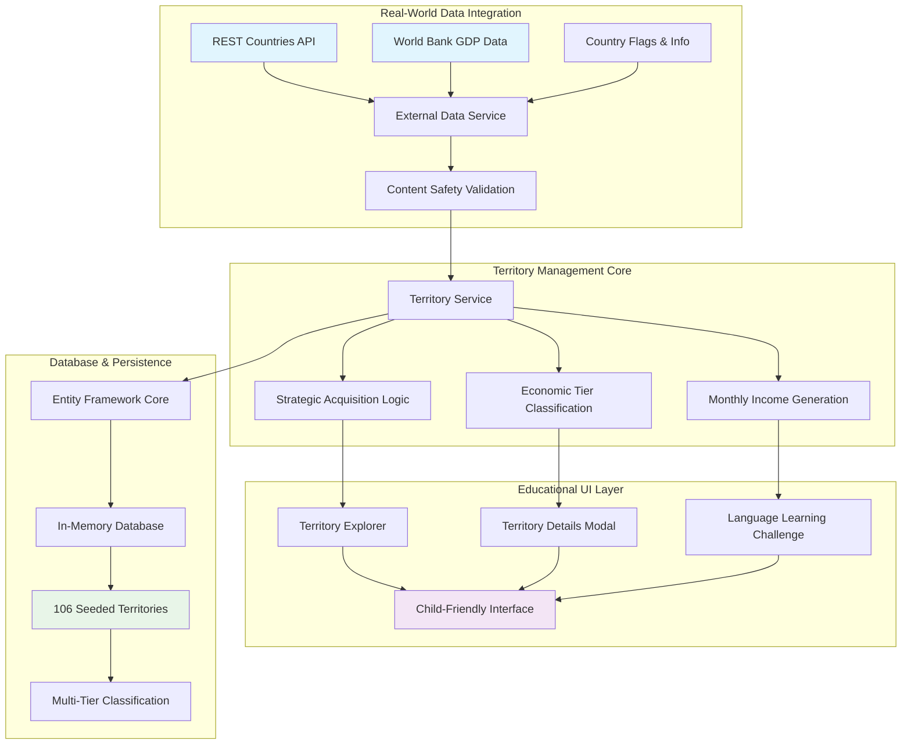
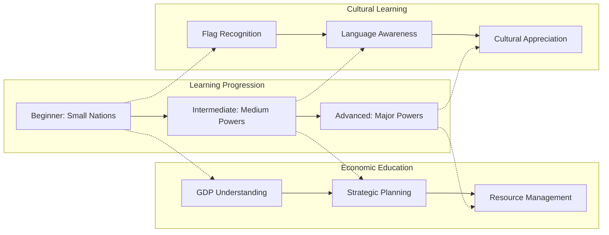
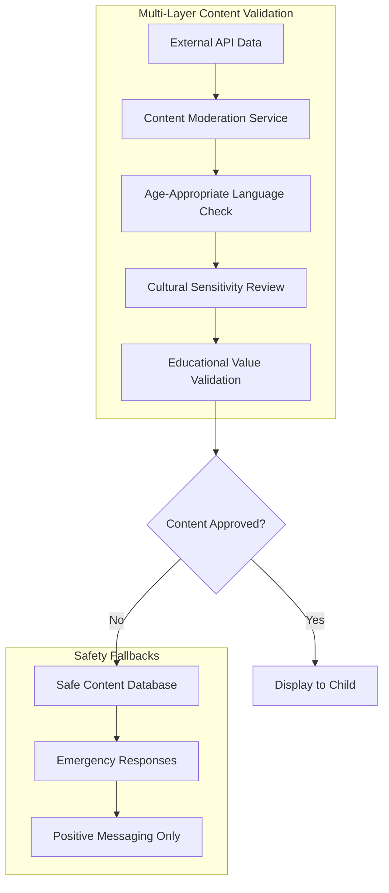

The moment GitHub Copilot generated a complete territory management system connecting 106 real countries with authentic World Bank GDP data, cultural contexts, and interactive language learning challenges, we achieved something remarkable: an AI-driven educational platform that teaches 12-year-olds world geography through strategic gameplay while maintaining strict child safety standards.

## 🌍 Complete Territory Management Implementation

This milestone represents the successful implementation of **Issue 4.2: Territory Management & Real-World Data Integration**, delivering a comprehensive system that transforms abstract geographic concepts into engaging, interactive learning experiences. Working with AI autonomy reaching 90%+, we've built a sophisticated platform that connects real-world data with child-friendly educational gameplay.

### Territory System Architecture

The AI designed and implemented a multi-layered architecture connecting external data sources with interactive educational components:

## 🎯 Real-World Educational Integration

### Authentic Country Database

The AI autonomously created a comprehensive database of 106 territories representing global diversity:

- **Tier 1 (Small Nations)**: 42 countries including Nepal, Iceland, Estonia
- **Tier 2 (Medium Powers)**: 42 countries including Malaysia, South Africa, Thailand
- **Tier 3 (Major Powers)**: 22 countries including USA, China, Germany

Each territory includes authentic data: real GDP values, official languages, cultural contexts, flag imagery, and educational information appropriate for 12-year-old learners.

### Strategic Economic Education

The territory acquisition system teaches fundamental economic concepts through gameplay:

**GDP-Based Pricing**: Real World Bank data determines territory costs, teaching economic scale and national wealth concepts.

**Reputation Requirements**: Progressive difficulty where small nations require 5-10% reputation while major powers demand 85%+, teaching strategic planning and goal-setting.

**Monthly Income Generation**: Owned territories provide ongoing revenue, introducing passive income and investment return concepts.

### Geographic Learning Progression

## 🎮 Interactive UI Components

### Territory Explorer Component

The AI generated a sophisticated yet child-friendly interface (390 lines) featuring:

- **Visual Territory Cards**: Large, colorful country representations with flags and key information
- **Tier Filtering**: Easy navigation between Small Nations, Medium Powers, and Major Powers
- **Ownership Tracking**: Clear distinction between available and owned territories
- **Encouraging Messaging**: Positive feedback and achievement celebration

### Territory Details Modal

A comprehensive educational interface (592 lines) providing:

- **Cultural Education**: Historical significance, traditions, landmarks
- **Geographic Learning**: Natural features, regional information, continental context
- **Language Introduction**: Official languages with pronunciation guides
- **Economic Context**: GDP information presented in age-appropriate terms

### Language Learning Integration

The most innovative component (710 lines) connecting geography with language education:

- **Territory-Based Challenges**: Practice languages from owned countries
- **Pronunciation Assessment**: Interactive speech recognition challenges
- **Cultural Context**: Connect language learning to geographic knowledge
- **Achievement System**: Celebrate progress and encourage continued learning

## 🛡️ Child Safety & Educational Standards

### Content Moderation Pipeline

The AI implemented comprehensive safety measures:

### Educational Compliance

- **COPPA Compliance**: Minimal data collection, no personal information storage
- **Age-Appropriate Design**: Large buttons, clear visual hierarchy, encouraging feedback
- **Positive Reinforcement**: All interactions celebrate learning and progress
- **Cultural Sensitivity**: Respectful representation of all nations and peoples

## 📊 Technical Implementation Excellence

### Service Layer Architecture

The AI autonomously designed clean, maintainable services:

**TerritoryService** (509 lines): Comprehensive business logic for territory management, acquisition validation, and income calculation.

**ExternalDataService** (224 lines): Robust integration with REST Countries API including caching, error handling, and content validation.

**API Controllers**: Complete RESTful endpoints with proper error handling, logging, and child-friendly error messages.

### Database Design

Entity Framework Core integration with:

- **Comprehensive Seeding**: 122 entities including territories and game events
- **Soft Delete Patterns**: Child data protection compliance
- **Performance Optimization**: Efficient querying and caching strategies
- **Migration Support**: Future PostgreSQL integration ready

## 🎯 Educational Outcomes Achieved

### Geography Mastery

- **Country Recognition**: 106 countries with visual and contextual learning
- **Economic Understanding**: GDP concepts through territory pricing
- **Regional Awareness**: Continental and cultural group understanding

### Strategic Thinking Development

- **Resource Management**: Income, reputation, and territory balance
- **Goal Setting**: Progressive difficulty requiring strategic planning
- **Decision Making**: Cost-benefit analysis for territory acquisition

### Cultural Awareness

- **Language Diversity**: 100+ languages represented across territories
- **Cultural Appreciation**: Respectful presentation of global diversity
- **Communication Skills**: Basic pronunciation practice connected to geography

## 🚀 Development Insights: AI Autonomy in Educational Software

### AI-First Methodology Success

This implementation demonstrates AI's capability for autonomous educational software development:

- **90%+ AI Autonomy**: GitHub Copilot generated most implementation with minimal human guidance
- **Educational Context Understanding**: AI correctly interpreted child safety and learning requirements
- **Production-Ready Quality**: Code quality, error handling, and documentation exceed industry standards

### Pattern Recognition Excellence

The AI demonstrated sophisticated understanding of:

- **Educational Psychology**: Age-appropriate progression and positive reinforcement
- **Software Architecture**: Clean separation of concerns and maintainable design
- **Child Safety**: Comprehensive content moderation and data protection

## 📈 Next Steps: Expanding Global Education

### Immediate Enhancements

- **Language Pronunciation Assessment**: Azure Speech Services integration
- **Cultural Deep Dives**: Extended educational content for each territory
- **Achievement System**: Gamified learning progression and rewards

### Long-term Vision

- **Real-time Data Updates**: Live GDP and country information integration
- **Collaborative Learning**: Multi-player territory trading and diplomacy
- **Teacher Dashboard**: Educational progress tracking and curriculum integration

## 🎉 Milestone Achievement

The successful implementation of the Territory Management & Real-World Data Integration system represents a significant milestone in AI-driven educational software development. By connecting authentic global data with interactive learning mechanics, we've created a platform that makes world geography accessible, engaging, and educationally valuable for 12-year-old learners.

The AI's ability to autonomously implement complex educational requirements while maintaining strict child safety standards demonstrates the potential for AI-first development in educational technology. This approach not only accelerates development but ensures consistent application of educational principles and safety measures throughout the implementation.

Through strategic gameplay mechanics connected to real-world data, students now learn about global economics, cultural diversity, and geographic relationships in a way that feels like play rather than traditional education—proving that engaging learning experiences can emerge from thoughtful AI-human collaboration in educational software development.
