# 💰 Building Child-Friendly Cost Transparency in Educational Gaming


_Our child-friendly cost dashboard transforms complex Azure billing into engaging educational content_

## 🎯 The Challenge: Making Cloud Costs Educational for Kids

When building the **World Leaders Game** - an educational strategy game for 12-year-olds - we faced a unique challenge: **How do you make Azure cloud costs both transparent and educational for children?**

Most cost dashboards are designed for enterprise architects and CFOs, not middle school students learning about digital literacy. We needed something that would:

- ✅ **Teach digital resource awareness** in age-appropriate language
- ✅ **Gamify budget management** without creating anxiety about money
- ✅ **Maintain child safety** with positive, encouraging messaging
- ✅ **Connect to real learning** about geography, economics, and technology

## 🚨 The Problem We Solved

**PR #42: Child-Friendly Cost Dashboard Implementation**

### **Problem-Solution Mapping**

<details>
<summary>🔍 Click to understand: Problem-Solution Architecture</summary>
<div class="explanation-content">
<p><strong>Educational Context:</strong> This diagram shows how technical problems in educational software require unique solutions that prioritize child experience over typical business metrics.</p>

<p><strong>Key Problem-Solving Insights:</strong></p>
<ul>
<li><strong>Transparency vs. Comprehension:</strong> Traditional cost dashboards provide transparency but lack educational context - children need to understand WHY services cost money</li>
<li><strong>Digital Literacy Gap:</strong> Kids use AI and cloud services but have no mental model of resource consumption - this creates dependency without understanding</li>
<li><strong>Emotional Safety:</strong> Budget alerts can create anxiety in children - positive messaging and learning adventure framing maintains engagement while teaching responsibility</li>
<li><strong>Technical Complexity:</strong> Aspire orchestration dependencies can prevent flexible deployment - commenting out dependencies enables multiple deployment scenarios</li>
</ul>

<p><strong>Design Philosophy:</strong> This represents child-centered software design where technical solutions must serve educational and emotional needs, not just functional requirements.</p>
</div>
</details>


Our latest pull request tackled several critical issues:

### 1. **Transparency Crisis** 🔍

**Problem**: Parents and teachers had no visibility into what Azure services were costing during gameplay.
**Solution**: Real-time cost tracking with educational context explaining each service's purpose.

### 2. **Digital Literacy Gap** 📚

**Problem**: Kids use cloud services daily but have no understanding of digital resource consumption.
**Solution**: Age-appropriate explanations connecting AI responses, speech recognition, and data storage to real costs.

### 3. **Budget Anxiety Prevention** 🛡️

**Problem**: Traditional cost dashboards can create stress about spending money.
**Solution**: Positive, encouraging messaging that frames costs as "learning adventure expenses" with educational achievements.

### 4. **Manual Deployment Complexity** ⚙️

**Problem**: The application relied on .NET Aspire orchestration, making manual deployment difficult.
**Solution**: Commented out Aspire dependencies to enable direct service startup for any environment.

## 🎨 The Child-Friendly Design Philosophy

### **Visual Language That Speaks to Kids**

<details>
<summary>🔍 Click to understand: Child-Friendly CSS Design System</summary>
<div class="explanation-content">
<p><strong>Educational Context:</strong> This CSS demonstrates how typography and visual design choices specifically target child cognitive development and engagement patterns.</p>

<p><strong>Key Design System Insights:</strong></p>
<ul>
<li><strong>Font Psychology:</strong> "Comic Neue" and "Arial Rounded" fonts reduce reading anxiety and create approachable, friendly interfaces for 12-year-olds</li>
<li><strong>Scale for Accessibility:</strong> 2.5rem (40px) titles and 3rem (48px) icons exceed minimum accessibility guidelines, accommodating varying visual acuity in children</li>
<li><strong>Cognitive Load Reduction:</strong> Large, clear visual elements reduce mental effort required to parse interface information</li>
<li><strong>Emotional Response:</strong> Rounded fonts and large emoji icons trigger positive emotional responses, reducing stress around financial concepts</li>
</ul>

<p><strong>Child UX Principles:</strong> This styling system prioritizes emotional safety and cognitive accessibility over minimalist design trends typically used in adult applications.</p>
</div>
</details>

```css
.dashboard-title {
  font-size: 2.5rem;
  font-weight: bold;
  font-family: "Comic Neue", "Arial Rounded", sans-serif;
}

.title-icon {
  font-size: 3rem; /* Large, friendly emoji icons */
}
```

We chose **Comic Neue** font family and large emoji icons (💰📊🤖) to create immediate visual appeal for 12-year-olds.

### **Encouraging Progress Indicators**

Instead of alarming "Budget Exceeded" warnings, we celebrate learning:

- ✅ "You have £0.040 left to explore!"
- ⚠️ "You've used your daily budget! Great learning today!"

### **Educational Service Explanations**

Complex Azure services become friendly learning tools:

- **AI Services** → "🤖 AI Learning Assistant - Your AI tutors and learning guides"
- **Speech Services** → "🗣️ Speech & Pronunciation - Language learning practice"
- **Storage** → "💾 Data Storage - Saving your game progress and achievements"

## 🔧 Technical Implementation Highlights

### **System Architecture Overview**

<details>
<summary>🔍 Click to understand: System Architecture Overview</summary>
<div class="explanation-content">
<p><strong>Educational Context:</strong> This architecture demonstrates how complex cost management systems can be simplified and made educational while maintaining enterprise-grade functionality.</p>

<p><strong>Key Architectural Insights:</strong></p>
<ul>
<li><strong>Child-Friendly Frontend Layer:</strong> Educational Components and Progress Indicators transform raw financial data into learning experiences</li>
<li><strong>Safety-First API Design:</strong> Child Content Moderator validates all cost information before presentation, ensuring age-appropriate financial education</li>
<li><strong>Graceful Degradation:</strong> Fallback System ensures educational value continues even when Azure APIs are unavailable</li>
<li><strong>Educational Metadata Service:</strong> Adds learning context to every cost item, transforming expenses into educational opportunities</li>
<li><strong>Separation of Concerns:</strong> Business logic in API layer is completely separated from child-facing presentation logic</li>
</ul>

<p><strong>Educational Software Pattern:</strong> This architecture represents a new pattern where enterprise functionality is wrapped in educational context rather than simplified or dumbed down.</p>
</div>
</details>


### **Smart Fallback System**

<details>
<summary>🔍 Click to understand: Graceful Fallback Implementation</summary>
<div class="explanation-content">
<p><strong>Educational Context:</strong> This C# code demonstrates how educational applications must maintain learning continuity even when external services fail.</p>

<p><strong>Key Implementation Insights:</strong></p>
<ul>
<li><strong>Try-Catch Educational Pattern:</strong> Unlike typical error handling, the catch block doesn't show errors to children - it gracefully switches to educational mock data</li>
<li><strong>Success Path Optimization:</strong> Real Azure API data is preferred when available, providing authentic cost education</li>
<li><strong>Transparent Fallback:</strong> LoadMockData() provides educational value that's equivalent to real data from a learning perspective</li>
<li><strong>Child Experience Priority:</strong> The learning experience never breaks - children continue learning whether APIs are available or not</li>
<li><strong>Async/Await Pattern:</strong> Proper async handling ensures UI remains responsive during API calls</li>
</ul>

<p><strong>Educational Software Principle:</strong> In child-focused applications, continuity of learning experience takes priority over technical accuracy or error reporting.</p>
</div>
</details>

```csharp
private async Task LoadCostData()
{
    try
    {
        // Try real API first
        var summaryResponse = await Http.GetAsync("/api/costmanagement/enhanced-summary");
        if (summaryResponse.IsSuccessStatusCode)
        {
            // Use real data
        }
    }
    catch (Exception apiEx)
    {
        // Graceful fallback to mock data for demonstration
        await LoadMockData();
    }
}
```

### **Child Learning Flow**

<details>
<summary>🔍 Click to understand: Child Learning Flow Decision Tree</summary>
<div class="explanation-content">
<p><strong>Educational Context:</strong> This flowchart demonstrates how educational applications must maintain positive learning experiences regardless of technical or budget constraints.</p>

<p><strong>Key Learning Flow Insights:</strong></p>
<ul>
<li><strong>Graceful Technical Degradation:</strong> API availability doesn't affect educational value - both paths lead to meaningful learning experiences</li>
<li><strong>Child-Friendly Language Transformation:</strong> Raw Azure data is transformed into age-appropriate explanations before presentation</li>
<li><strong>Positive Budget Messaging:</strong> Both "Under Budget" and "Over Budget" scenarios are celebrated, preventing financial anxiety in children</li>
<li><strong>Achievement Focus:</strong> The flow culminates in "Learning Achievement Celebration" rather than cost warnings or technical status</li>
<li><strong>Continuous Learning Loop:</strong> All paths lead back to "Continue Learning," ensuring the educational experience never ends</li>
</ul>

<p><strong>Child Psychology Applied:</strong> This flow incorporates child development principles where exploration is encouraged and "failure" is reframed as learning achievement.</p>
</div>
</details>



```mermaid
flowchart TD
    A[Child Opens Dashboard] --> B{API Available?}
    B -->|Yes| C[Load Real Azure Costs]
    B -->|No| D[Load Educational Mock Data]

    C --> E[Transform to Child-Friendly Language]
    D --> E

    E --> F[Display Visual Progress]
    F --> G[Show Service Breakdown]
    G --> H[Educational Explanations]
    H --> I[Learning Achievement Celebration]

    I --> J{Budget Status?}
    J -->|Under Budget| K["✅ You have £X left to explore!"]
    J -->|Over Budget| L["🎉 Great learning today!"]

    K --> M[Continue Learning]
    L --> M

    style A fill:#e8f5e8
    style E fill:#fff3e0
    style I fill:#e1f5fe
    style K fill:#e8f5e8
    style L fill:#fff9c4
```

The dashboard gracefully handles API unavailability by showing educational mock data, ensuring the learning experience never breaks.

### **Child Safety-First Architecture**

Every component includes educational context comments:

<details>
<summary>🔍 Click to understand: Educational Component Documentation Pattern</summary>
<div class="explanation-content">
<p><strong>Educational Context:</strong> This Razor component comment pattern demonstrates how to document child-focused software with educational objectives clearly defined.</p>

<p><strong>Key Documentation Insights:</strong></p>
<ul>
<li><strong>Context-First Documentation:</strong> Immediately establishes this is for 12-year-old players, not generic users</li>
<li><strong>Educational Objective Clarity:</strong> Specific learning goals (digital resource awareness, budget management) are documented at the component level</li>
<li><strong>Safety Requirements Integration:</strong> Child safety considerations are documented alongside technical requirements</li>
<li><strong>Age-Appropriate Specification:</strong> "Child-friendly presentation" and "positive messaging" specify UX requirements unique to child applications</li>
<li><strong>Educational Value Validation:</strong> Every component must justify its educational contribution</li>
</ul>

<p><strong>Documentation Evolution:</strong> This represents an evolution from technical documentation to educational software documentation that prioritizes learning outcomes and child development principles.</p>
</div>
</details>

```razor
@*
Context: Educational cost dashboard for 12-year-old players
Educational Objective: Teach digital resource awareness and budget management
Safety Requirements: Child-friendly presentation, positive messaging, educational value
*@
```

### **Manual Deployment Support**

We solved the Aspire dependency issue by making services manually startable:

<details>
<summary>🔍 Click to understand: Aspire Dependency Management</summary>
<div class="explanation-content">
<p><strong>Educational Context:</strong> This C# configuration shows how to make educational software deployable in various environments by managing orchestration dependencies.</p>

<p><strong>Key Deployment Insights:</strong></p>
<ul>
<li><strong>Conditional Orchestration:</strong> Commenting out Aspire dependencies allows manual service startup, critical for educational environments with varied infrastructure</li>
<li><strong>Manual Health Checks:</strong> When Aspire orchestration isn't available, manual health check registration ensures monitoring capabilities remain</li>
<li><strong>Educational Environment Flexibility:</strong> Schools and educational institutions often have restricted deployment capabilities - this configuration accommodates those constraints</li>
<li><strong>Service Defaults Pattern:</strong> Aspire's AddServiceDefaults() provides enterprise features (logging, telemetry, health checks) in orchestrated environments</li>
<li><strong>Graceful Degradation:</strong> Application functionality remains complete whether running in Aspire orchestration or manual deployment</li>
</ul>

<p><strong>Educational Software Deployment:</strong> This pattern prioritizes deployment flexibility over advanced orchestration features, ensuring educational software can run in diverse institutional environments.</p>
</div>
</details>

```csharp
// Add service defaults (Aspire) - Comment out for manual execution
// builder.AddServiceDefaults();

// Add health checks manually when not using Aspire
builder.Services.AddHealthChecks();
```

## 📊 Real Educational Impact

### **Cost-to-Learning Value Chain**

<details>
<summary>🔍 Click to understand: Cost-to-Learning Value Chain</summary>
<div class="explanation-content">
<p><strong>Educational Context:</strong> This diagram demonstrates how small Azure service costs translate into measurable educational outcomes for children.</p>

<p><strong>Key Value Chain Insights:</strong></p>
<ul>
<li><strong>Micro-Transaction Learning:</strong> Extremely small costs (£0.0017 per AI interaction) enable experimentation without financial stress</li>
<li><strong>Direct Learning Correlation:</strong> Each Azure service cost directly corresponds to specific educational achievements</li>
<li><strong>Measurable Outcomes:</strong> Countries Learned, Pronunciation Score, and Efficiency Rating provide quantifiable educational value</li>
<li><strong>Cost Transparency Education:</strong> Children learn the actual cost of AI, speech recognition, and data storage services</li>
<li><strong>Value Demonstration:</strong> Parents can see precise educational return on investment for cloud service spending</li>
</ul>

<p><strong>Educational Economics:</strong> This represents a new model where cloud computing costs become part of the educational curriculum, teaching digital literacy alongside traditional subjects.</p>
</div>
</details>


The cost dashboard teaches multiple concepts simultaneously:

### **Digital Literacy** 🖥️

- Understanding that AI responses cost money
- Learning about cloud service consumption
- Connecting actions to resource usage

### **Budget Management** 💷

- Daily spending limits (£0.08/day per user)
- Progress tracking with visual indicators
- Predictive forecasting for future costs

### **Geography & Economics** 🌍

- Cost per territory acquisition
- Economic efficiency scoring
- Real-world GDP data integration

## 🎮 Gamification Without Monetization

Unlike mobile games that pressure kids to spend money, our approach:

- **Celebrates efficiency** rather than pushing spending
- **Educational achievements** unlock features, not payments
- **Transparent costs** build understanding, not addiction
- **Positive reinforcement** for smart resource management

## 🛡️ Child Protection Standards

### **Safety-First Design Process**

<details>
<summary>🔍 Click to understand: Child Safety Validation Pipeline</summary>
<div class="explanation-content">
<p><strong>Educational Context:</strong> This flowchart shows how every piece of content presented to children goes through multiple safety and educational validation layers.</p>

<p><strong>Key Safety Architecture Insights:</strong></p>
<ul>
<li><strong>Multi-Gate Validation:</strong> Content must pass Child Safety, Educational Value, Age Appropriateness, and Cultural Sensitivity checks</li>
<li><strong>Safe Fallback Philosophy:</strong> Any validation failure triggers safe fallback responses rather than error messages</li>
<li><strong>Continuous Learning Loop:</strong> Incidents are logged and used to improve AI models, creating a continuously safer system</li>
<li><strong>Positive Messaging Wrapper:</strong> Even approved content gets wrapped in encouraging, positive language before reaching children</li>
<li><strong>Parent/Teacher Transparency:</strong> All interactions are logged for adult oversight while maintaining child engagement</li>
</ul>

<p><strong>Child Protection Innovation:</strong> This represents a new standard for child-safe AI where protection systems are built into the architecture rather than added as afterthoughts.</p>
</div>
</details>


Every design decision prioritized child safety:

### **COPPA Compliance** 👶

- No personal information collection
- Parental oversight capabilities
- Educational value validation

### **Positive Messaging** 😊

- No shame around budget limits
- Achievement celebration over spending pressure
- Encouraging language throughout

### **Cultural Sensitivity** 🌍

- Respectful representation of all countries
- Inclusive design principles
- Age-appropriate complexity levels

## 🚀 Technical Stack & Architecture

### **Full System Architecture**

<details>
<summary>🔍 Click to understand: Full System Architecture</summary>
<div class="explanation-content">
<p><strong>Educational Context:</strong> This comprehensive architecture diagram shows how enterprise-grade cost management can be made educational and child-safe through careful layer design.</p>

<p><strong>Key Architectural Insights:</strong></p>
<ul>
<li><strong>Layer Separation:</strong> Frontend Layer focuses entirely on child experience while API Layer handles complex business logic and external service integration</li>
<li><strong>Educational Metadata Service:</strong> Dedicated service adds learning context to every piece of data before presentation to children</li>
<li><strong>Child Content Moderator:</strong> Specialized validation service ensures all cost information is appropriate for educational use</li>
<li><strong>Fallback Data Generator:</strong> Ensures educational continuity by providing meaningful mock data when external services are unavailable</li>
<li><strong>Multi-Service Integration:</strong> Real-time cost tracking connects to multiple Azure services and external educational data sources</li>
</ul>

<p><strong>Educational Software Architecture Pattern:</strong> This demonstrates how complex enterprise systems can be made educational through dedicated educational metadata and child safety layers rather than simplification.</p>
</div>
</details>


**Technology Stack:**

- **Frontend**: Blazor Server with TailwindCSS for child-friendly styling
- **Backend**: .NET 8 LTS with Azure Cost Management APIs
- **Data**: Real-time cost tracking with educational metadata
- **Deployment**: Manual service startup without Aspire dependency
- **Safety**: Multi-layer content validation and fallback systems

## 📈 What's Next?

This cost dashboard is just the beginning. Future enhancements include:

1. **Parent/Teacher Reports** - Weekly educational progress summaries
2. **Cost Optimization Challenges** - Gamified efficiency competitions
3. **Real-World Connections** - Comparing game costs to everyday purchases
4. **Multi-Language Support** - Cost education in different languages

## 💡 Key Takeaways for Developers

### **Child-Friendly ≠ Simple**

Creating educational technology for children requires sophisticated design thinking. Age-appropriate doesn't mean dumbed down - it means carefully crafted for cognitive development stages.

### **Transparency Builds Trust**

Showing costs openly, even to children, builds digital literacy and trust. Parents appreciate knowing exactly what their child's learning costs.

### **Fallback Systems Are Essential**

Educational applications must never break the learning flow. Robust fallback systems ensure continuous educational value.

### **Manual Deployment Matters**

Not every deployment environment supports orchestration platforms like Aspire. Design for flexibility from day one.

## 🎉 Try It Yourself!

The World Leaders Game is open source and available on GitHub. The cost dashboard is now live and demonstrates how to make enterprise-grade cost management educational and engaging for young learners.

**Repository**: [WorldLeadersGame](https://github.com/victorsaly/WorldLeadersGame)
**Live Demo**: [Cost Dashboard in Action](http://docs.worldleadersgame.co.uk/cost-dashboard)

---

## 💬 Discussion

How do you approach cost transparency in your educational applications? Have you found effective ways to teach digital literacy to children? Share your experiences in the comments!

**Tags**: #EducationalTechnology #ChildSafety #CostManagement #DigitalLiteracy #BlazorServer #GameDevelopment #UIUXDesign

---

_Victor Saly is building educational technology that combines AI, gaming, and real-world learning. Follow for more insights on creating safe, engaging educational experiences for children._
