# 💰 Building Child-Friendly Cost Transparency in Educational Gaming


_Our child-friendly cost dashboard transforms complex Azure billing into engaging educational content_

## 🎯 The Challenge: Making Cloud Costs Educational for Kids

When building the **World Leaders Game** - an educational strategy game for 12-year-olds - we faced a unique challenge: **How do you make Azure cloud costs both transparent and educational for children?**

Most cost dashboards are designed for enterprise architects and CFOs, not middle school students learning about digital literacy. We needed something that would:

- ✅ **Teach digital resource awareness** in age-appropriate language
- ✅ **Gamify budget management** without creating anxiety about money
- ✅ **Maintain child safety** with positive, encouraging messaging
- ✅ **Connect to real learning** about geography, economics, and technology

## 🚨 The Problem We Solved

**PR #42: Child-Friendly Cost Dashboard Implementation**

### **Problem-Solution Mapping**


Our latest pull request tackled several critical issues:

### 1. **Transparency Crisis** 🔍

**Problem**: Parents and teachers had no visibility into what Azure services were costing during gameplay.
**Solution**: Real-time cost tracking with educational context explaining each service's purpose.

### 2. **Digital Literacy Gap** 📚

**Problem**: Kids use cloud services daily but have no understanding of digital resource consumption.
**Solution**: Age-appropriate explanations connecting AI responses, speech recognition, and data storage to real costs.

### 3. **Budget Anxiety Prevention** 🛡️

**Problem**: Traditional cost dashboards can create stress about spending money.
**Solution**: Positive, encouraging messaging that frames costs as "learning adventure expenses" with educational achievements.

### 4. **Manual Deployment Complexity** ⚙️

**Problem**: The application relied on .NET Aspire orchestration, making manual deployment difficult.
**Solution**: Commented out Aspire dependencies to enable direct service startup for any environment.

## 🎨 The Child-Friendly Design Philosophy

### **Visual Language That Speaks to Kids**

```css
.dashboard-title {
  font-size: 2.5rem;
  font-weight: bold;
  font-family: "Comic Neue", "Arial Rounded", sans-serif;
}

.title-icon {
  font-size: 3rem; /* Large, friendly emoji icons */
}
```

We chose **Comic Neue** font family and large emoji icons (💰📊🤖) to create immediate visual appeal for 12-year-olds.

### **Encouraging Progress Indicators**

Instead of alarming "Budget Exceeded" warnings, we celebrate learning:

- ✅ "You have £0.040 left to explore!"
- ⚠️ "You've used your daily budget! Great learning today!"

### **Educational Service Explanations**

Complex Azure services become friendly learning tools:

- **AI Services** → "🤖 AI Learning Assistant - Your AI tutors and learning guides"
- **Speech Services** → "🗣️ Speech & Pronunciation - Language learning practice"
- **Storage** → "💾 Data Storage - Saving your game progress and achievements"

## 🔧 Technical Implementation Highlights

### **System Architecture Overview**


### **Smart Fallback System**

```csharp
private async Task LoadCostData()
{
    try
    {
        // Try real API first
        var summaryResponse = await Http.GetAsync("/api/costmanagement/enhanced-summary");
        if (summaryResponse.IsSuccessStatusCode)
        {
            // Use real data
        }
    }
    catch (Exception apiEx)
    {
        // Graceful fallback to mock data for demonstration
        await LoadMockData();
    }
}
```

### **Child Learning Flow**

```mermaid
flowchart TD
    A[Child Opens Dashboard] --> B{API Available?}
    B -->|Yes| C[Load Real Azure Costs]
    B -->|No| D[Load Educational Mock Data]

    C --> E[Transform to Child-Friendly Language]
    D --> E

    E --> F[Display Visual Progress]
    F --> G[Show Service Breakdown]
    G --> H[Educational Explanations]
    H --> I[Learning Achievement Celebration]

    I --> J{Budget Status?}
    J -->|Under Budget| K["✅ You have £X left to explore!"]
    J -->|Over Budget| L["🎉 Great learning today!"]

    K --> M[Continue Learning]
    L --> M

    style A fill:#e8f5e8
    style E fill:#fff3e0
    style I fill:#e1f5fe
    style K fill:#e8f5e8
    style L fill:#fff9c4
```



The dashboard gracefully handles API unavailability by showing educational mock data, ensuring the learning experience never breaks.

### **Child Safety-First Architecture**

Every component includes educational context comments:

```razor
@*
Context: Educational cost dashboard for 12-year-old players
Educational Objective: Teach digital resource awareness and budget management
Safety Requirements: Child-friendly presentation, positive messaging, educational value
*@
```

### **Manual Deployment Support**

We solved the Aspire dependency issue by making services manually startable:

```csharp
// Add service defaults (Aspire) - Comment out for manual execution
// builder.AddServiceDefaults();

// Add health checks manually when not using Aspire
builder.Services.AddHealthChecks();
```

## 📊 Real Educational Impact

### **Cost-to-Learning Value Chain**


The cost dashboard teaches multiple concepts simultaneously:

### **Digital Literacy** 🖥️

- Understanding that AI responses cost money
- Learning about cloud service consumption
- Connecting actions to resource usage

### **Budget Management** 💷

- Daily spending limits (£0.08/day per user)
- Progress tracking with visual indicators
- Predictive forecasting for future costs

### **Geography & Economics** 🌍

- Cost per territory acquisition
- Economic efficiency scoring
- Real-world GDP data integration

## 🎮 Gamification Without Monetization

Unlike mobile games that pressure kids to spend money, our approach:

- **Celebrates efficiency** rather than pushing spending
- **Educational achievements** unlock features, not payments
- **Transparent costs** build understanding, not addiction
- **Positive reinforcement** for smart resource management

## 🛡️ Child Protection Standards

### **Safety-First Design Process**


Every design decision prioritized child safety:

### **COPPA Compliance** 👶

- No personal information collection
- Parental oversight capabilities
- Educational value validation

### **Positive Messaging** 😊

- No shame around budget limits
- Achievement celebration over spending pressure
- Encouraging language throughout

### **Cultural Sensitivity** 🌍

- Respectful representation of all countries
- Inclusive design principles
- Age-appropriate complexity levels

## 🚀 Technical Stack & Architecture

### **Full System Architecture**


**Technology Stack:**

- **Frontend**: Blazor Server with TailwindCSS for child-friendly styling
- **Backend**: .NET 8 LTS with Azure Cost Management APIs
- **Data**: Real-time cost tracking with educational metadata
- **Deployment**: Manual service startup without Aspire dependency
- **Safety**: Multi-layer content validation and fallback systems

## 📈 What's Next?

This cost dashboard is just the beginning. Future enhancements include:

1. **Parent/Teacher Reports** - Weekly educational progress summaries
2. **Cost Optimization Challenges** - Gamified efficiency competitions
3. **Real-World Connections** - Comparing game costs to everyday purchases
4. **Multi-Language Support** - Cost education in different languages

## 💡 Key Takeaways for Developers

### **Child-Friendly ≠ Simple**

Creating educational technology for children requires sophisticated design thinking. Age-appropriate doesn't mean dumbed down - it means carefully crafted for cognitive development stages.

### **Transparency Builds Trust**

Showing costs openly, even to children, builds digital literacy and trust. Parents appreciate knowing exactly what their child's learning costs.

### **Fallback Systems Are Essential**

Educational applications must never break the learning flow. Robust fallback systems ensure continuous educational value.

### **Manual Deployment Matters**

Not every deployment environment supports orchestration platforms like Aspire. Design for flexibility from day one.

## 🎉 Try It Yourself!

The World Leaders Game is open source and available on GitHub. The cost dashboard is now live and demonstrates how to make enterprise-grade cost management educational and engaging for young learners.

**Repository**: [WorldLeadersGame](https://github.com/victorsaly/WorldLeadersGame)
**Live Demo**: [Cost Dashboard in Action](http://docs.worldleadersgame.co.uk/cost-dashboard)

---

## 💬 Discussion

How do you approach cost transparency in your educational applications? Have you found effective ways to teach digital literacy to children? Share your experiences in the comments!

**Tags**: #EducationalTechnology #ChildSafety #CostManagement #DigitalLiteracy #BlazorServer #GameDevelopment #UIUXDesign

---

_Victor Saly is building educational technology that combines AI, gaming, and real-world learning. Follow for more insights on creating safe, engaging educational experiences for children._
