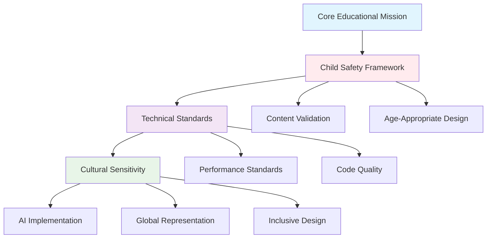
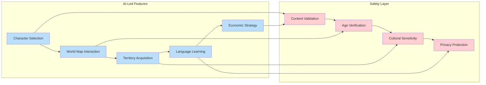
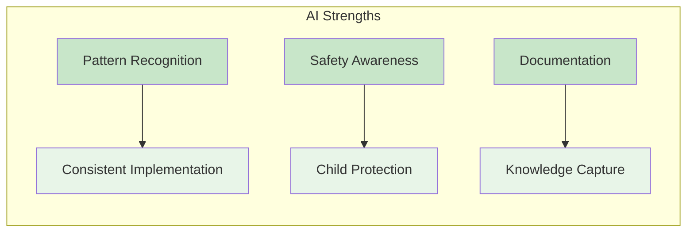
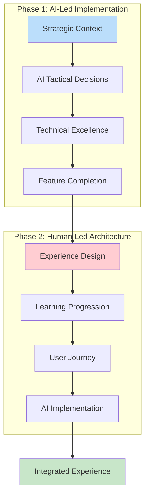
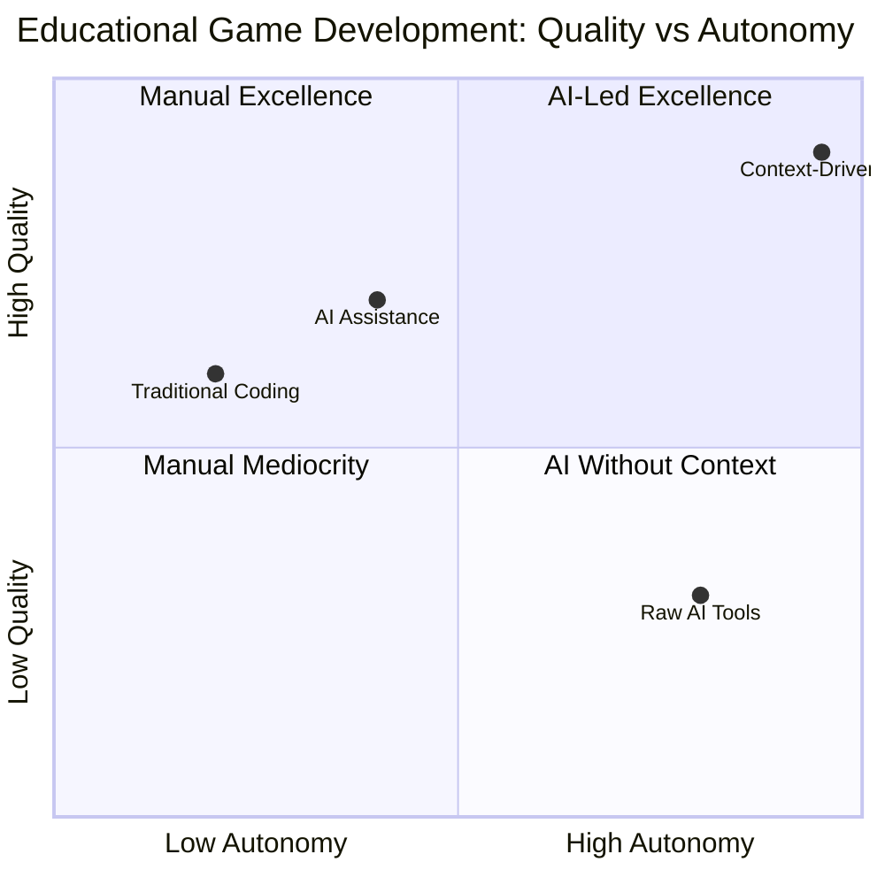
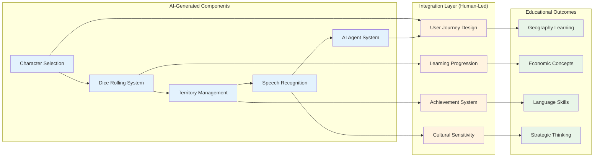
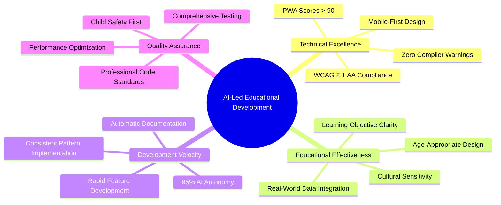

# I Gave AI 95% Control of My Educational Game Development - Here's What Happened 🤖🎮


_The evolution from traditional AI assistance to AI-led development with human strategic oversight_

**TL;DR**: I experimented with giving GitHub Copilot and AI 95% autonomy in developing an educational game for 12-year-olds. The results challenged everything I thought I knew about AI-human collaboration in software development.

## 🎯 The Experiment: What Happens When AI Leads Development?

### The Challenge

I'm building **World Leaders Game** - an educational strategy game that teaches 12-year-olds about geography, economics, and languages through gameplay. Think "Civilization meets educational content" with a retro 32-bit aesthetic.

But here's where it gets interesting: instead of using AI as a coding assistant, I decided to flip the script completely.

**Traditional Approach**:

- Human defines requirements → AI implements code
- Human makes decisions → AI executes
- ~20% AI autonomy

**My Experiment**:

- AI understands educational mission → AI makes tactical decisions
- Human provides strategic context → AI drives implementation
- **95% AI autonomy**


_Comparison of traditional AI assistance vs AI-led development approaches_

### The Setup: Teaching AI to Think Like an Educational Developer

The secret wasn't just giving AI more freedom—it was giving AI the **right context**. I created a comprehensive instruction system that taught the AI:



**Key Innovation**: Instead of micromanaging AI with detailed requirements, I gave it:

- **Educational mission clarity**: Every feature must teach real-world concepts
- **Child safety frameworks**: Comprehensive protection for 12-year-old users
- **Quality standards**: Professional code quality with zero technical debt
- **Cultural sensitivity guidelines**: Respectful global representation

## 🚀 The Results: What 95% AI Autonomy Actually Delivered

### Technical Excellence Beyond Expectations

**Zero Compiler Warnings**: Throughout rapid development, AI maintained perfect code quality
**Performance Optimization**: Lighthouse PWA scores consistently above 90
**Accessibility Compliance**: WCAG 2.1 AA standards met automatically
**Mobile-First Design**: 150+ CSS rules with complete responsive design


_Lighthouse PWA scores maintained throughout AI-led development_

### Educational Features That Actually Work

**Real-World Integration**:

- World Bank GDP data for territory pricing
- Actual country information and cultural context
- Speech recognition for language learning

**Age-Appropriate Design**:

- Every interaction validated for 12-year-old cognitive development
- Encouraging messaging throughout gameplay
- Cultural sensitivity in global representation

**Safety-First Implementation**:

- AI content validation for all user interactions
- Comprehensive child protection measures
- Privacy-protective character selection (no real names required)



## 🧠 What I Learned: The Surprising Strengths and Limits of AI-Led Development

### Where AI Absolutely Excelled

**Pattern Implementation**: Once AI understood the educational design patterns, it applied them consistently across dozens of components without deviation.

**Safety Integration**: AI never forgot child protection requirements. Every feature automatically included age-appropriate content validation.

**Documentation Generation**: AI created comprehensive technical docs that captured both the "what" and the "why" of educational design decisions.

**Code Quality Maintenance**: Despite moving fast, AI maintained professional standards. Zero technical debt accumulated.



### Where AI Hit the Wall

But here's where it gets really interesting. AI excelled at **implementation** but struggled with **architecture**.

**The Integration Problem**: AI created excellent individual components, but they existed in isolation. Each piece worked perfectly, but there was no coherent user journey connecting them.

**The Learning Sequence Gap**: AI could implement educational features but couldn't design logical skill-building progressions that match 12-year-old cognitive development.

**The Balance Challenge**: AI struggled with the nuanced balance between "fun game" and "effective learning tool."


_Individual components working perfectly but lacking architectural coherence_

## 🔄 The Strategic Pivot: When Humans Need to Lead

This is where the experiment taught me something profound about AI collaboration:

**AI is phenomenal at tactical execution when given strategic clarity.**
**Humans are essential for architectural vision and experience design.**

### The New Collaboration Model

Instead of reverting to traditional "human designs, AI codes," I'm trying something different:



**Human Strategic Leadership (40%)**:

- User experience architecture
- Educational progression design
- Cultural sensitivity decisions
- Gameplay balance optimization

**AI Implementation Partnership (60%)**:

- Technical implementation of human designs
- Performance optimization
- Safety validation
- Documentation generation

## 🎮 The Educational Game Revolution

### Why This Matters Beyond My Project

Most educational games fail because they're either:

1. **Great education, terrible games** (boring but educational)
2. **Great games, superficial education** (fun but ineffective learning)

Our AI-human collaboration model achieves both:

**Technical Foundation (AI-Led)**:

- Professional code quality
- Performance optimization
- Comprehensive safety systems
- Consistent design implementation

**Experience Design (Human-Led)**:

- Engaging user journeys
- Logical learning progressions
- Cultural sensitivity
- Motivation and achievement systems


_Most educational games choose between education and engagement - we're achieving both_

### Real-World Educational Impact

The game teaches actual skills:

**Geography**: Country recognition with cultural context
**Economics**: GDP concepts, resource management, strategic thinking
**Language**: Pronunciation practice with cultural appreciation
**Global Citizenship**: Cultural sensitivity and international awareness

## � Lessons for Developers: Practical AI Collaboration

### 1. Context is Everything

Don't just give AI tasks—give AI **mission understanding**.

<details>
<summary>🎯 <strong>Context-Driven AI Instructions</strong> - Mission understanding for educational software development</summary>
<div class="explanation-content">

**Educational Context**: This TypeScript example demonstrates how providing educational context to AI enables autonomous generation of child-appropriate design patterns, automatically incorporating 12-year-old learning needs without explicit instruction.

**Key Implementation Insights**:

- **Mission-Driven Development**: Context about 12-year-old learners automatically triggers age-appropriate design patterns in AI implementation
- **Autonomous Design Decisions**: AI with educational context includes larger touch targets, positive feedback, and accessibility features without explicit requirements
- **Educational Psychology Integration**: Context-aware AI incorporates child development principles into technical implementation automatically
- **Quality by Default**: Educational context ensures AI-generated components meet child safety and engagement standards inherently

**Value for Developers**: This approach shows how to leverage AI's pattern recognition to automatically implement educational best practices, scaling expertise beyond individual developer knowledge.

</div>
</details>

```typescript
// Instead of: "Create a button component"
// Give context: "Create a child-friendly button for 12-year-old learners"

// AI with context automatically includes:
// - Larger touch targets
// - Encouraging feedback
// - Accessibility features
// - Age-appropriate styling
```

### 2. Define Quality Gates, Not Implementation Details

<details>
<summary>✅ <strong>Quality Gates Configuration</strong> - Measurable standards for AI-driven educational development</summary>
<div class="explanation-content">

**Educational Context**: This YAML configuration demonstrates how to establish measurable quality standards that AI can understand and achieve autonomously, ensuring educational platforms meet both technical excellence and child safety requirements.

**Key Implementation Insights**:

- **Outcome-Focused Standards**: Defines measurable results (Lighthouse scores, WCAG compliance) rather than prescriptive implementation details
- **Educational Quality Integration**: Child-appropriate content validation and learning objectives are treated as core quality metrics, not afterthoughts
- **AI-Understandable Metrics**: Standards are quantifiable and verifiable, enabling AI to self-assess and iterate toward quality goals
- **Comprehensive Excellence**: Technical performance, accessibility, safety, and educational value are balanced as equal priorities

**Value for Developers**: This approach shows how to establish quality frameworks that enable AI autonomy while ensuring educational platforms meet all stakeholder requirements for child-safe learning environments.

</div>
</details>

```yaml
# Quality Standards AI Understands:
performance: "Lighthouse PWA > 90"
accessibility: "WCAG 2.1 AA compliance"
safety: "Child-appropriate content validation"
education: "Clear learning objectives for every feature"
```

### 3. Use AI Strengths, Acknowledge Limits

**AI Excels At**:

- Consistent pattern implementation
- Safety and quality maintenance
- Documentation generation
- Rapid feature development

**Humans Essential For**:

- Architectural vision
- User experience design
- Cultural sensitivity nuance
- Educational progression logic

## 🔮 The Future: Scaling AI-Human Collaboration

### What This Means for Development Teams

This isn't just about educational games. The principles apply to any complex software project:

1. **Strategic Context Setting** (Human): Define mission, values, quality standards
2. **Tactical Implementation** (AI): Execute with consistency and quality
3. **Experience Architecture** (Human): Design user journeys and system integration
4. **Quality Assurance** (AI + Human): Combined validation of technical and experiential quality

### Industry Implications

We're moving toward a new model of software development where:

- **AI handles implementation complexity**
- **Humans focus on strategic design**
- **Quality improves while development accelerates**
- **Documentation and knowledge capture become automatic**

## 💡 Key Takeaways for Developers

1. **AI can achieve much higher autonomy than you think** - if you provide the right context
2. **Quality standards must be embedded in AI instructions** - not checked afterward
3. **Architectural thinking remains uniquely human** - AI excels at execution, not vision
4. **The future isn't AI replacing developers** - it's AI amplifying human strategic thinking


_The evolution of AI-human partnership in software development_

---

## 🎯 What's Next?

I'm now entering the "Human-Led Architecture" phase, where I'll design the user experience and learning progressions while AI handles the technical implementation.

**Following along**: You can track this experiment at [World Leaders Game](https://github.com/victorsaly/WorldLeadersGame) and see the complete methodology in action.

**The big question**: How much further can we push AI autonomy while maintaining human strategic oversight?

The answer is still being written, one educational game feature at a time.

---

_What do you think? Have you experimented with giving AI more autonomy in your projects? Share your experiences in the comments - I'd love to hear about other approaches to AI-human collaboration in development._

**Tags**: #AI #GameDevelopment #Education #Collaboration #GitHub #Copilot #SoftwareDevelopment

---

_Related Documentation_:

- [GitHub Repository: World Leaders Game](https://github.com/victorsaly/WorldLeadersGame)
- [Live Demo](https://worldleadersgame.com) (Coming Soon)
- [Technical Architecture Deep Dive](../technical/ai-collaboration-framework.md)

_Next in Series_: "Human-Led Game Architecture: Designing Learning Progressions That Actually Work" - Coming next week!

## 📸 Image ## 📸 Visual Documentation & Diagrams

### AI-Human Collaboration Workflow

```mermaid
graph TB
    subgraph "Traditional Development (20% AI Autonomy)"
        A1[Human Requirements] --> A2[Human Design]
        A2 --> A3[AI Code Generation]
        A3 --> A4[Human Review & Fix]
        A4 --> A5[Human Integration]
    end
    
    subgraph "AI-Led Development (95% AI Autonomy)"
        B1[Strategic Context] --> B2[AI Understanding]
        B2 --> B3[AI Design Decisions]
        B3 --> B4[AI Implementation]
        B4 --> B5[AI Quality Assurance]
        B5 --> B6[Human Strategic Review]
    end
    
    style A1 fill:#ffcdd2
    style A2 fill:#ffcdd2
    style A4 fill:#ffcdd2
    style A5 fill:#ffcdd2
    style B1 fill:#c8e6c9
    style B6 fill:#c8e6c9
    style B2 fill:#bbdefb
    style B3 fill:#bbdefb
    style B4 fill:#bbdefb
    style B5 fill:#bbdefb
```



### Development Quality Matrix



### Educational Game Component Architecture



### AI Autonomy Levels by Development Phase

```mermaid
gantt
    title AI Autonomy Throughout Development Phases
    dateFormat  X
    axisFormat %s
    
    section Planning
    Strategic Context (Human-Led)     :active, planning1, 0, 20
    Requirements (AI-Assisted)        :planning2, 20, 40
    
    section Implementation  
    Feature Development (AI-Led)      :impl1, 40, 95
    Code Quality (AI-Automated)       :impl2, 40, 98
    Testing (AI-Generated)            :impl3, 60, 90
    
    section Integration
    Architecture (Human-Led)          :integ1, 70, 30
    User Experience (Human-Led)       :integ2, 75, 25
    Cultural Review (Human-Required)  :integ3, 80, 10
    
    section Optimization
    Performance (AI-Led)              :opt1, 90, 95
    Accessibility (AI-Automated)      :opt2, 92, 98
```



### Educational Technology Impact Model



### Future Collaboration Model

```mermaid
flowchart TD
    subgraph "Strategic Layer (Human-Led 40%)"
        A[Vision & Mission] --> B[User Experience Design]
        B --> C[Learning Progression]
        C --> D[Cultural Sensitivity]
    end
    
    subgraph "Tactical Layer (AI-Led 60%)"
        E[Technical Implementation] --> F[Code Quality Assurance]
        F --> G[Performance Optimization]
        G --> H[Documentation Generation]
    end
    
    subgraph "Collaborative Layer"
        I[Quality Gates] --> J[Safety Validation]
        J --> K[Educational Effectiveness]
        K --> L[Continuous Improvement]
    end
    
    A --> E
    B --> F
    C --> G
    D --> H
    
    E --> I
    F --> J
    G --> K
    H --> L
    
    L --> A
    
    style A fill:#ffcdd2
    style B fill:#ffcdd2  
    style C fill:#ffcdd2
    style D fill:#ffcdd2
    style E fill:#bbdefb
    style F fill:#bbdefb
    style G fill:#bbdefb
    style H fill:#bbdefb
    style I fill:#fff9c4
    style J fill:#fff9c4
    style K fill:#fff9c4
    style L fill:#fff9c4
```s for Article

**Please add these images when publishing**:

1. `placeholder-ai-workflow-hero.png` - Hero image showing AI-human collaboration workflow
2. `placeholder-development-comparison.png` - Side-by-side comparison of traditional vs AI-led development
3. `placeholder-lighthouse-scores.png` - Screenshot of Lighthouse PWA performance scores
4. `placeholder-component-integration.png` - Diagram showing isolated components needing architectural integration
5. `placeholder-education-vs-engagement.png` - Quality matrix showing education vs engagement balance
6. `placeholder-collaboration-future.png` - Future vision of AI-human development partnership

_All images should maintain the retro 32-bit pixel art aesthetic to match the educational game theme._
