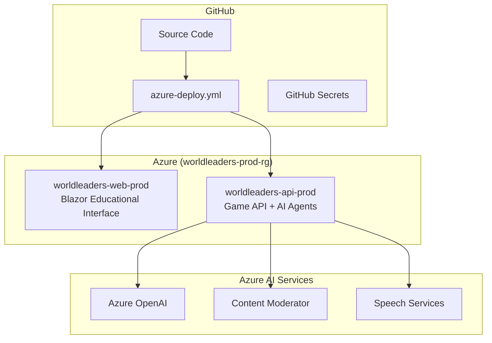

# 🚀 World Leaders Game - Azure Deployment Guide

Simple guide for deploying the educational game to Azure using the `azure-deploy.yml` workflow.

## 📋 Prerequisites

### ✅ Current Status
- [x] Azure subscription: `VSE - Victor Saly`
- [x] Azure AI services: OpenAI, Content Moderator, Speech Services
- [x] Educational game code complete
- [x] GitHub repository with `azure-deploy.yml` workflow

### 🔧 Required Tools
- [Azure CLI](https://docs.microsoft.com/en-us/cli/azure/install-azure-cli) - for managing Azure resources
- Git - for pushing code changes

## 🏗️ Current Architecture



## 🔐 Step 1: Verify GitHub Secrets

Your `azure-deploy.yml` workflow requires these GitHub secrets:

### Azure Authentication (OIDC)
```bash
# Check if secrets are set (run in your repository)
gh secret list
```

**Required secrets:**
- `AZURE_CLIENT_ID` - Service Principal Client ID
- `AZURE_TENANT_ID` - Azure AD Tenant ID  
- `AZURE_SUBSCRIPTION_ID` - Azure Subscription ID

### Setting Up Azure Authentication

If secrets are missing, create them:

```bash
# 1. Create Service Principal for GitHub Actions
az ad sp create-for-rbac \
  --name "worldleaders-github-actions" \
  --role contributor \
  --scopes /subscriptions/YOUR_SUBSCRIPTION_ID/resourceGroups/worldleaders-prod-rg

# 2. Set GitHub secrets using the output
gh secret set AZURE_CLIENT_ID --body "CLIENT_ID_FROM_OUTPUT"
gh secret set AZURE_TENANT_ID --body "TENANT_ID_FROM_OUTPUT"
gh secret set AZURE_SUBSCRIPTION_ID --body "YOUR_SUBSCRIPTION_ID"
```

### Verify Azure Resources Exist

```bash
# Check if resource group exists
az group show --name worldleaders-prod-rg

# Check if app services exist
az webapp show --name worldleaders-web-prod --resource-group worldleaders-prod-rg
az webapp show --name worldleaders-api-prod --resource-group worldleaders-prod-rg
```

If resources don't exist, create them:

```bash
# Create resource group
az group create --name worldleaders-prod-rg --location "UK South"

# Create app services
az webapp create \
  --name worldleaders-web-prod \
  --resource-group worldleaders-prod-rg \
  --plan worldleaders-app-plan \
  --runtime "DOTNET:8.0"

az webapp create \
  --name worldleaders-api-prod \
  --resource-group worldleaders-prod-rg \
  --plan worldleaders-app-plan \
  --runtime "DOTNET:8.0"
```

## 🚀 Step 2: Deploy to Production

### Automatic Deployment
Push changes to the `main` branch to trigger deployment:

```bash
git add .
git commit -m "🚀 Deploy educational game to Azure"
git push origin main
```

### Manual Deployment
Trigger deployment manually:

1. Go to your repository on GitHub
2. Click **Actions** tab
3. Select **Deploy World Leaders Game to Azure**
4. Click **Run workflow**

## 📊 Step 3: Monitor Deployment

### GitHub Actions Dashboard
Monitor progress at: `https://github.com/victorsaly/WorldLeadersGame/actions`

### Deployment Stages
1. **🔨 Build & Test Educational Game** - Compile .NET 8 application
2. **🌐 Build Web App** - Create Blazor educational interface
3. **🔧 Build API** - Create game API with AI integration
4. **🚀 Deploy to Azure** - Deploy both components
5. **🎉 Post-Deployment Validation** - Verify deployment success

## 🎯 Production URLs

After successful deployment:

- **🌐 Educational Game**: `https://worldleaders-web-prod.azurewebsites.net`
- **🔗 Game API**: `https://worldleaders-api-prod.azurewebsites.net`
- **🩺 API Health**: `https://worldleaders-api-prod.azurewebsites.net/health`
- **📖 API Docs**: `https://worldleaders-api-prod.azurewebsites.net/swagger`

## 🔧 Step 4: Post-Deployment Configuration

### Verify AI Services Integration

Test AI services are properly connected:

```bash
# Test API health endpoint
curl https://worldleaders-api-prod.azurewebsites.net/health

# Test territories endpoint (uses real-world data)
curl https://worldleaders-api-prod.azurewebsites.net/api/game/territories
```

### Configure Application Settings (if needed)

If AI services need configuration, update app settings:

```bash
# Configure API app settings
az webapp config appsettings set \
  --name worldleaders-api-prod \
  --resource-group worldleaders-prod-rg \
  --settings \
    "AzureOpenAI__Endpoint=YOUR_OPENAI_ENDPOINT" \
    "AzureOpenAI__ApiKey=YOUR_OPENAI_KEY"

# Configure Web app settings  
az webapp config appsettings set \
  --name worldleaders-web-prod \
  --resource-group worldleaders-prod-rg \
  --settings \
    "ApiSettings__BaseUrl=https://worldleaders-api-prod.azurewebsites.net"
```

## 🛡️ Step 5: Security & Child Safety Verification

### Child Safety Features
✅ **Educational Content**: Age-appropriate for 12-year-olds  
✅ **Content Moderation**: Azure AI content filtering  
✅ **Secure API**: Protected endpoints with proper validation  
✅ **HTTPS Only**: All traffic encrypted  

### Security Verification
```bash
# Check HTTPS configuration
curl -I https://worldleaders-web-prod.azurewebsites.net

# Check API security headers
curl -I https://worldleaders-api-prod.azurewebsites.net/health
```

## 🧪 Step 6: Production Testing

### Automated Tests
The deployment includes automatic testing:
- Build and compilation success
- Educational safety validation
- Health endpoint verification

### Manual Testing Checklist
- [ ] **Game Access**: Visit web app URL loads correctly
- [ ] **API Health**: Health endpoint returns 200 OK
- [ ] **Educational Content**: Game displays appropriate for 12-year-olds
- [ ] **Real-World Data**: Territories load with actual country data
- [ ] **Child Safety**: Content moderation working

## 🆘 Troubleshooting

### Common Issues

#### Deployment Fails
1. **Check GitHub Actions logs** in the Actions tab
2. **Verify Azure secrets** are configured correctly
3. **Check Azure resource group** exists: `worldleaders-prod-rg`
4. **Verify permissions** for service principal

#### App Not Loading
1. **Check app service status** in Azure Portal
2. **Review application logs** in Azure Portal
3. **Verify .NET 8 runtime** is configured
4. **Check startup commands** are correct

#### API Not Responding
1. **Test health endpoint**: `/health`
2. **Check CORS configuration** for web app
3. **Verify API app settings** for AI services
4. **Review API logs** in Azure Portal

### Quick Debug Commands
```bash
# Check app service status
az webapp show --name worldleaders-web-prod --resource-group worldleaders-prod-rg --query "state"
az webapp show --name worldleaders-api-prod --resource-group worldleaders-prod-rg --query "state"

# View recent logs
az webapp log tail --name worldleaders-api-prod --resource-group worldleaders-prod-rg
az webapp log tail --name worldleaders-web-prod --resource-group worldleaders-prod-rg

# Restart services if needed
az webapp restart --name worldleaders-web-prod --resource-group worldleaders-prod-rg
az webapp restart --name worldleaders-api-prod --resource-group worldleaders-prod-rg
```

## 🎓 Educational Value

This deployment provides:

### For Students (12-year-olds)
- **Safe Learning Environment**: Child-appropriate content and interactions
- **Real-World Learning**: Actual country data and economic concepts  
- **Interactive Education**: Engaging game mechanics teach geography and economics
- **AI-Assisted Learning**: Educational AI agents support learning objectives

### For Educators
- **Reliable Platform**: Production-grade deployment with monitoring
- **Educational Standards**: Curriculum-aligned learning objectives
- **Child Safety**: Content moderation and age-appropriate design
- **Scalable Access**: Available to students worldwide

## 🎉 Success!

Once deployed, your World Leaders Educational Game provides:
- **Educational Excellence**: Teaching geography, economics, and strategic thinking
- **Child Safety**: Age-appropriate content with AI moderation
- **Production Quality**: Reliable, scalable platform for learning
- **Real-World Integration**: Actual country data enhances educational value

**Ready for 12-year-old learners worldwide! 🌟**

---

*This guide focuses on the `azure-deploy.yml` workflow and current Azure resource configuration. For development setup, see other technical guides.*
