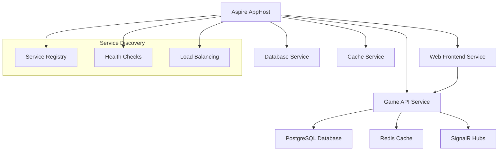

# .NET Aspire Integration Guide 🚀

**Focus**: Complete implementation guide for .NET Aspire orchestration in educational game development  
**Context**: Practical patterns learned from World Leaders Game architecture  
**Audience**: .NET developers exploring cloud-native application orchestration

---

## 🎯 Overview

.NET Aspire transforms distributed application development by providing:

- **Orchestration**: Simplified multi-service coordination
- **Service Discovery**: Automatic service-to-service communication
- **Health Monitoring**: Built-in health checks and observability
- **Development Experience**: Unified debugging and deployment

### Why Aspire for Educational Games?

1. **Scalability**: Handle varying player loads automatically
2. **Observability**: Track student engagement and learning metrics
3. **Resilience**: Ensure reliable educational experiences
4. **Developer Productivity**: Focus on educational content, not infrastructure

---

## 🏗️ Architecture Overview



---

## 📁 Project Structure

```
WorldLeaders.sln
├── WorldLeaders.AppHost/           # Aspire orchestration
├── WorldLeaders.ServiceDefaults/   # Shared service configuration
├── WorldLeaders.API/               # Game backend service
├── WorldLeaders.Web/               # Blazor frontend service
├── WorldLeaders.Infrastructure/    # Data layer
└── WorldLeaders.Shared/            # Common models and DTOs
```

---

## 🔧 Implementation Guide

### 1. AppHost Configuration

```csharp
// Program.cs in WorldLeaders.AppHost
var builder = DistributedApplication.CreateBuilder(args);

// Database service
var postgres = builder.AddPostgreSQL("postgres")
    .WithPgAdmin()
    .AddDatabase("worldleaders");

// Cache service
var redis = builder.AddRedis("cache")
    .WithRedisCommander();

// API service with dependencies
var apiService = builder.AddProject<Projects.WorldLeaders_API>("gameapi")
    .WithReference(postgres)
    .WithReference(redis)
    .WithExternalHttpEndpoints();

// Web frontend service
var webService = builder.AddProject<Projects.WorldLeaders_Web>("webapp")
    .WithReference(apiService)
    .WithExternalHttpEndpoints();

// Build and run
await builder.Build().RunAsync();
```

### 2. Service Defaults Configuration

```csharp
// Extensions.cs in WorldLeaders.ServiceDefaults
public static class Extensions
{
    public static IHostApplicationBuilder AddServiceDefaults(
        this IHostApplicationBuilder builder)
    {
        // Health checks
        builder.Services.AddHealthChecks();

        // Service discovery
        builder.Services.AddServiceDiscovery();

        // Observability
        builder.Services.AddOpenTelemetry()
            .WithMetrics(metrics =>
            {
                metrics.AddAspNetCoreInstrumentation()
                       .AddHttpClientInstrumentation()
                       .AddRuntimeInstrumentation();
            })
            .WithTracing(tracing =>
            {
                tracing.AddAspNetCoreInstrumentation()
                       .AddHttpClientInstrumentation();
            });

        // HTTP client configuration
        builder.Services.ConfigureHttpClientDefaults(http =>
        {
            http.AddStandardResilienceHandler();
            http.AddServiceDiscovery();
        });

        return builder;
    }
}
```

### 3. API Service Integration

```csharp
// Program.cs in WorldLeaders.API
var builder = WebApplication.CreateBuilder(args);

// Add service defaults
builder.AddServiceDefaults();

// Database context
builder.AddNpgsqlDbContext<WorldLeadersDbContext>("worldleaders");

// Redis cache
builder.AddRedisClient("cache");

// SignalR for real-time features
builder.Services.AddSignalR();

// API services
builder.Services.AddControllers();
builder.Services.AddEndpointsApiExplorer();
builder.Services.AddSwaggerGen();

var app = builder.Build();

// Configure pipeline
if (app.Environment.IsDevelopment())
{
    app.UseSwagger();
    app.UseSwaggerUI();
}

app.UseHttpsRedirection();
app.UseAuthorization();
app.MapControllers();
app.MapHub<GameHub>("/gamehub");

// Health checks endpoint
app.MapHealthChecks("/health");

await app.RunAsync();
```

### 4. Web Service Integration

```csharp
// Program.cs in WorldLeaders.Web
var builder = WebApplication.CreateBuilder(args);

// Add service defaults
builder.AddServiceDefaults();

// Blazor services
builder.Services.AddRazorPages();
builder.Services.AddServerSideBlazor();

// HTTP client for API calls
builder.Services.AddHttpClient<GameApiClient>(client =>
{
    client.BaseAddress = new Uri("https+http://gameapi");
});

var app = builder.Build();

// Configure pipeline
if (!app.Environment.IsDevelopment())
{
    app.UseExceptionHandler("/Error");
    app.UseHsts();
}

app.UseHttpsRedirection();
app.UseStaticFiles();
app.UseRouting();

app.MapRazorPages();
app.MapBlazorHub();
app.MapFallbackToPage("/_Host");

// Health checks
app.MapHealthChecks("/health");

await app.RunAsync();
```

---

## 🔍 Service Discovery Implementation

### API Client with Service Discovery

```csharp
// GameApiClient.cs
public class GameApiClient
{
    private readonly HttpClient _httpClient;

    public GameApiClient(HttpClient httpClient)
    {
        _httpClient = httpClient;
    }

    public async Task<List<Territory>> GetTerritoriesAsync()
    {
        // Service discovery automatically resolves 'gameapi' to actual endpoint
        var response = await _httpClient.GetAsync("/api/game/territories");
        response.EnsureSuccessStatusCode();

        var json = await response.Content.ReadAsStringAsync();
        return JsonSerializer.Deserialize<List<Territory>>(json);
    }

    public async Task<GameState> JoinGameAsync(string playerId)
    {
        var content = new StringContent(
            JsonSerializer.Serialize(new { PlayerId = playerId }),
            Encoding.UTF8,
            "application/json");

        var response = await _httpClient.PostAsync("/api/game/join", content);
        response.EnsureSuccessStatusCode();

        var json = await response.Content.ReadAsStringAsync();
        return JsonSerializer.Deserialize<GameState>(json);
    }
}
```

---

## 📊 Health Monitoring

### Custom Health Checks

```csharp
// GameHealthCheck.cs
public class GameHealthCheck : IHealthCheck
{
    private readonly WorldLeadersDbContext _context;
    private readonly IDistributedCache _cache;

    public GameHealthCheck(
        WorldLeadersDbContext context,
        IDistributedCache cache)
    {
        _context = context;
        _cache = cache;
    }

    public async Task<HealthCheckResult> CheckHealthAsync(
        HealthCheckContext context,
        CancellationToken cancellationToken = default)
    {
        try
        {
            // Check database connectivity
            await _context.Database.CanConnectAsync(cancellationToken);

            // Check cache connectivity
            await _cache.SetStringAsync("health_check", "ok", cancellationToken);
            var cacheValue = await _cache.GetStringAsync("health_check", cancellationToken);

            if (cacheValue != "ok")
                return HealthCheckResult.Degraded("Cache not responding correctly");

            return HealthCheckResult.Healthy("All systems operational");
        }
        catch (Exception ex)
        {
            return HealthCheckResult.Unhealthy("System failure", ex);
        }
    }
}

// Registration in Program.cs
builder.Services.AddHealthChecks()
    .AddCheck<GameHealthCheck>("game_health")
    .AddNpgsql(connectionString: builder.Configuration.GetConnectionString("worldleaders"))
    .AddRedis(connectionString: builder.Configuration.GetConnectionString("cache"));
```

---

## 🚀 Development Workflow

### 1. Local Development

```bash
# Start Aspire orchestration
dotnet run --project src/WorldLeaders/WorldLeaders.AppHost

# Aspire dashboard will be available at:
# https://localhost:15888
```

### 2. Service Dependencies

The Aspire dashboard provides:

- **Service Map**: Visual representation of service dependencies
- **Logs**: Centralized logging from all services
- **Metrics**: Performance metrics and health status
- **Traces**: Distributed tracing across service calls

### 3. Environment Configuration

```json
// appsettings.Development.json in AppHost
{
  "Aspire": {
    "Dashboard": {
      "Port": 15888
    }
  },
  "Services": {
    "GameAPI": {
      "Replicas": 1,
      "EnvironmentVariables": {
        "ASPNETCORE_ENVIRONMENT": "Development"
      }
    },
    "WebApp": {
      "Replicas": 1,
      "EnvironmentVariables": {
        "ASPNETCORE_ENVIRONMENT": "Development"
      }
    }
  }
}
```

---

## 🔒 Security Configuration

### Service-to-Service Authentication

```csharp
// In API service
builder.Services.AddAuthentication()
    .AddJwtBearer(options =>
    {
        options.Authority = builder.Configuration["Auth:Authority"];
        options.Audience = "worldleaders-api";
    });

// In Web service
builder.Services.AddAuthentication()
    .AddCookie(options =>
    {
        options.LoginPath = "/auth/login";
        options.LogoutPath = "/auth/logout";
    });
```

---

## 📈 Performance Optimization

### Caching Strategies

```csharp
// Game state caching
public class GameStateService
{
    private readonly IDistributedCache _cache;
    private readonly WorldLeadersDbContext _context;

    public async Task<GameState> GetGameStateAsync(string gameId)
    {
        var cacheKey = $"gamestate:{gameId}";
        var cached = await _cache.GetStringAsync(cacheKey);

        if (cached != null)
        {
            return JsonSerializer.Deserialize<GameState>(cached);
        }

        var gameState = await _context.GameStates
            .Include(gs => gs.Territories)
            .Include(gs => gs.Players)
            .FirstOrDefaultAsync(gs => gs.Id == gameId);

        if (gameState != null)
        {
            await _cache.SetStringAsync(
                cacheKey,
                JsonSerializer.Serialize(gameState),
                new DistributedCacheEntryOptions
                {
                    SlidingExpiration = TimeSpan.FromMinutes(10)
                });
        }

        return gameState;
    }
}
```

---

## 🐛 Debugging and Troubleshooting

### Common Issues and Solutions

1. **Service Discovery Failures**

   ```bash
   # Check service registration
   curl https://localhost:15888/api/services
   ```

2. **Database Connection Issues**

   ```csharp
   // Add connection retry policy
   builder.Services.AddDbContext<WorldLeadersDbContext>(options =>
   {
       options.UseNpgsql(connectionString, npgsqlOptions =>
       {
           npgsqlOptions.EnableRetryOnFailure(
               maxRetryCount: 3,
               maxRetryDelay: TimeSpan.FromSeconds(30),
               errorCodesToAdd: null);
       });
   });
   ```

3. **Performance Issues**
   - Monitor metrics in Aspire dashboard
   - Check database query performance
   - Analyze distributed traces for bottlenecks

---

## 🎯 Best Practices

### 1. Configuration Management

- Use environment variables for service configuration
- Implement configuration validation
- Use secrets management for sensitive data

### 2. Error Handling

- Implement circuit breaker patterns
- Use retry policies for transient failures
- Provide meaningful error messages

### 3. Monitoring

- Set up comprehensive health checks
- Monitor key business metrics
- Implement alerting for critical failures

### 4. Testing

- Use Aspire's testing utilities
- Implement integration tests across services
- Test failure scenarios and recovery

---

## 📚 Additional Resources

- [.NET Aspire Documentation](https://docs.microsoft.com/aspnet/core/aspire/)
- [Service Discovery Patterns](https://microservices.io/patterns/service-registry.html)
- [Distributed Application Patterns](https://docs.microsoft.com/azure/architecture/patterns/)

---

_This guide reflects real-world implementation patterns from the World Leaders Game project, combining AI-generated architecture with human validation and optimization._
