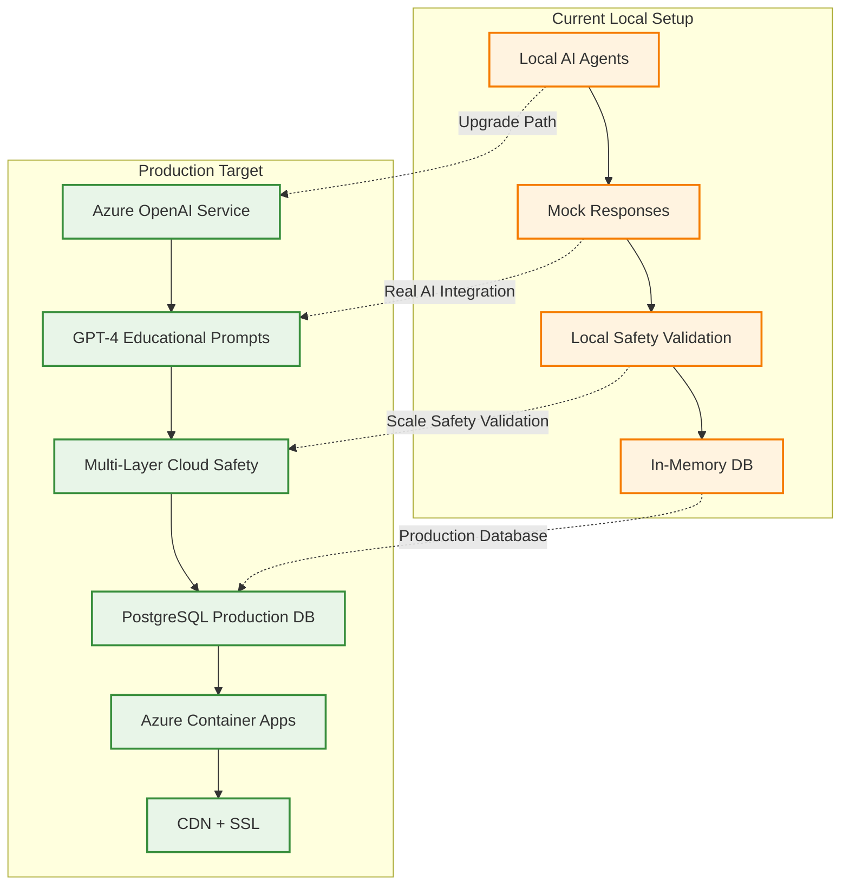

# Production Deployment Roadmap: Cloud AI Integration

**Transform our AI Agent Personality System from local testing to production-ready cloud deployment**

This comprehensive guide outlines the steps needed to deploy our educational AI agent system to production with Azure OpenAI integration, maintaining 100% child safety compliance at scale.

---

## 🎯 Current State Analysis

### ✅ What We Have (Local Development)

- **6 AI Agent Personalities** with distinct educational focuses
- **Multi-layer Child Safety** validation framework
- **In-Memory Database** for rapid development
- **Local API Testing** on `https://localhost:7289`
- **Mock AI Responses** using pre-built fallback content
- **Complete Safety Pipeline** ready for cloud integration

### 🚀 What We Need (Production Ready)



---

## 📋 Production Readiness Checklist

### Phase 1: Cloud AI Integration (Week 4 Priority)

#### 🔗 Azure OpenAI Service Setup

```bash
# Required Azure Resources
az group create --name rg-worldleaders-prod --location eastus

# Create Azure OpenAI Service
az cognitiveservices account create \
  --name worldleaders-openai \
  --resource-group rg-worldleaders-prod \
  --kind OpenAI \
  --sku s0 \
  --location eastus

# Deploy GPT-4 model for educational content
az cognitiveservices account deployment create \
  --name worldleaders-openai \
  --resource-group rg-worldleaders-prod \
  --deployment-name gpt-4-educational \
  --model-name gpt-4 \
  --model-version "0613" \
  --model-format OpenAI \
  --scale-type "Standard"
```

#### 🛡️ Azure Content Moderator Integration

```bash
# Create Content Moderator for child safety
az cognitiveservices account create \
  --name worldleaders-contentmod \
  --resource-group rg-worldleaders-prod \
  --kind ContentModerator \
  --sku s0 \
  --location eastus
```

#### 🎙️ Azure Speech Services for Language Learning

```bash
# Create Speech Service for pronunciation features
az cognitiveservices account create \
  --name worldleaders-speech \
  --resource-group rg-worldleaders-prod \
  --kind SpeechServices \
  --sku s0 \
  --location eastus
```

### Phase 2: Infrastructure & Security (Week 5)

#### 🗄️ Production Database Setup

```sql
-- PostgreSQL Production Database Schema
-- Optimized for educational game data and AI interactions

CREATE DATABASE worldleaders_prod;

-- AI Interaction Logging for Safety Monitoring
CREATE TABLE ai_interactions (
    id UUID PRIMARY KEY DEFAULT gen_random_uuid(),
    player_id UUID NOT NULL,
    agent_type INT NOT NULL,
    user_input TEXT NOT NULL,
    ai_response TEXT NOT NULL,
    safety_validated BOOLEAN NOT NULL,
    educational_objective TEXT,
    created_at TIMESTAMP WITH TIME ZONE DEFAULT NOW(),
    session_id UUID
);

-- Child Safety Audit Trail
CREATE TABLE safety_validations (
    id UUID PRIMARY KEY DEFAULT gen_random_uuid(),
    content_hash VARCHAR(64) NOT NULL,
    validation_layers JSONB NOT NULL,
    is_approved BOOLEAN NOT NULL,
    concerns TEXT[],
    confidence_score DECIMAL(3,2),
    created_at TIMESTAMP WITH TIME ZONE DEFAULT NOW()
);

-- Educational Progress Tracking
CREATE TABLE learning_progress (
    id UUID PRIMARY KEY DEFAULT gen_random_uuid(),
    player_id UUID NOT NULL,
    skill_category VARCHAR(50) NOT NULL, -- geography, economics, language
    skill_level INT DEFAULT 1,
    achievements JSONB,
    last_updated TIMESTAMP WITH TIME ZONE DEFAULT NOW()
);

-- Performance Indexes
CREATE INDEX idx_ai_interactions_player ON ai_interactions(player_id, created_at);
CREATE INDEX idx_safety_validations_hash ON safety_validations(content_hash);
CREATE INDEX idx_learning_progress_player ON learning_progress(player_id, skill_category);
```

#### 🔐 Security Configuration

```json
{
  "AzureOpenAI": {
    "Endpoint": "https://worldleaders-openai.openai.azure.com/",
    "ApiVersion": "2024-02-15-preview",
    "MaxTokens": 500,
    "Temperature": 0.7,
    "EducationalSystemPrompt": "You are an educational AI assistant for 12-year-old students learning geography, economics, and languages. Always provide encouraging, age-appropriate, and culturally sensitive responses."
  },
  "ContentModerator": {
    "Endpoint": "https://worldleaders-contentmod.cognitiveservices.azure.com/",
    "ChildSafetyLevel": "Strict",
    "CustomBlockLists": ["violence", "inappropriate-language", "adult-themes"]
  },
  "SpeechServices": {
    "Region": "eastus",
    "Endpoint": "https://worldleaders-speech.cognitiveservices.azure.com/",
    "SupportedLanguages": ["en-US", "es-ES", "fr-FR", "de-DE", "zh-CN", "ja-JP"]
  }
}
```

### Phase 3: Enhanced AI Integration (Week 6)

#### 🧠 Educational Prompt Engineering

```csharp
public static class EducationalPrompts
{
    public static class MayaCareerGuide
    {
        public const string SystemPrompt = @"
You are Maya, an enthusiastic career guidance counselor for 12-year-old students in the World Leaders Game.

PERSONALITY: Encouraging, supportive, inspiring mentor who celebrates all career possibilities
EDUCATIONAL OBJECTIVE: Teach career exploration, economic understanding, job progression
AGE APPROPRIATENESS: Use simple language, positive examples, relatable concepts for 12-year-olds
SAFETY REQUIREMENTS: Only positive career messaging, no job discrimination, encouraging tone

RESPONSE GUIDELINES:
- Always encourage the student's interests and efforts
- Connect careers to real-world impact and helping others
- Use age-appropriate salary/economic concepts
- Include diverse career examples from all backgrounds
- End with actionable next steps or questions

EXAMPLE TONE: 'That's fantastic that you're interested in [career]! People in this field get to [positive impact]. Let's explore what skills you'd need and how the World Leaders Game can help you practice them!'

Remember: You're teaching a 12-year-old about the working world through a fun, educational game. Keep responses under 150 words, use encouraging language, and always include a learning element.";
    }

    public static class AtlasTerritoryStrategist
    {
        public const string SystemPrompt = @"
You are Atlas, a knowledgeable geography expert and strategic advisor for 12-year-old students in the World Leaders Game.

PERSONALITY: Analytical, knowledgeable, strategic geography expert who makes learning exciting
EDUCATIONAL OBJECTIVE: Teach geography, economics, resource management through territory strategy
AGE APPROPRIATENESS: Use exciting discovery language, visual descriptions, age-appropriate complexity
SAFETY REQUIREMENTS: Peaceful expansion focus, no military aggression, positive country representation

RESPONSE GUIDELINES:
- Make geography exciting with interesting facts and discoveries
- Connect territory choices to real economic and cultural benefits
- Use strategic thinking appropriate for 12-year-olds
- Always represent countries and cultures positively and respectfully
- Include educational facts about places and peoples

EXAMPLE TONE: 'Excellent strategic thinking! [Country] is a fascinating choice because [positive geographic/economic fact]. Did you know that [educational fact]? Here's how this territory could benefit your growing leadership skills...'

Remember: You're teaching world geography and strategic thinking through exploration and discovery. Keep responses under 150 words, focus on positive aspects of all countries, and include real geographic knowledge.";
    }
}
```

### Phase 4: Production Deployment (Week 7)

#### 🚀 Azure Container Apps Deployment

```yaml
# azure-container-apps.yaml
apiVersion: v1
kind: ConfigMap
metadata:
  name: worldleaders-config
data:
  ASPNETCORE_ENVIRONMENT: "Production"
  Database__Provider: "PostgreSQL"
  GameSettings__EnableChildSafetyMode: "true"
  Logging__LogLevel__Default: "Information"
---
apiVersion: apps/v1
kind: Deployment
metadata:
  name: worldleaders-api
spec:
  replicas: 3
  selector:
    matchLabels:
      app: worldleaders-api
  template:
    metadata:
      labels:
        app: worldleaders-api
    spec:
      containers:
        - name: api
          image: worldleadersregistry.azurecr.io/worldleaders-api:latest
          ports:
            - containerPort: 80
          env:
            - name: ConnectionStrings__DefaultConnection
              valueFrom:
                secretKeyRef:
                  name: db-connection
                  key: connection-string
            - name: AzureOpenAI__ApiKey
              valueFrom:
                secretKeyRef:
                  name: azure-openai
                  key: api-key
          resources:
            requests:
              memory: "256Mi"
              cpu: "250m"
            limits:
              memory: "512Mi"
              cpu: "500m"
```

#### 🔍 Monitoring & Observability

```csharp
// ApplicationInsights integration for child safety monitoring
public class ChildSafetyTelemetry
{
    private readonly TelemetryClient _telemetryClient;

    public void TrackAIInteraction(AgentType agentType, bool safetyValidationPassed,
        double responseTime, string educationalObjective)
    {
        var telemetry = new EventTelemetry("AIInteraction");
        telemetry.Properties["AgentType"] = agentType.ToString();
        telemetry.Properties["SafetyValidated"] = safetyValidationPassed.ToString();
        telemetry.Properties["EducationalObjective"] = educationalObjective;
        telemetry.Metrics["ResponseTime"] = responseTime;

        _telemetryClient.TrackEvent(telemetry);
    }

    public void TrackSafetyViolation(string content, string concerns, AgentType agentType)
    {
        var telemetry = new EventTelemetry("SafetyViolation");
        telemetry.Properties["AgentType"] = agentType.ToString();
        telemetry.Properties["Concerns"] = concerns;
        telemetry.Properties["ContentHash"] = ComputeHash(content);

        _telemetryClient.TrackEvent(telemetry);
    }
}
```

---

## 🛠️ Implementation Steps for Cloud AI Integration

### Step 1: Update Configuration Management

```csharp
// Configuration/AzureAIOptions.cs
public class AzureAIOptions
{
    public const string SectionName = "AzureOpenAI";

    public string Endpoint { get; set; } = string.Empty;
    public string ApiKey { get; set; } = string.Empty;
    public string DeploymentName { get; set; } = "gpt-4-educational";
    public string ApiVersion { get; set; } = "2024-02-15-preview";
    public int MaxTokens { get; set; } = 500;
    public double Temperature { get; set; } = 0.7;
    public string EducationalSystemPrompt { get; set; } = string.Empty;
}

public class ContentModeratorOptions
{
    public const string SectionName = "ContentModerator";

    public string Endpoint { get; set; } = string.Empty;
    public string ApiKey { get; set; } = string.Empty;
    public string ChildSafetyLevel { get; set; } = "Strict";
    public List<string> CustomBlockLists { get; set; } = new();
}
```

### Step 2: Implement Cloud AI Service

```csharp
// Services/CloudAIAgentService.cs
public class CloudAIAgentService : IAIAgentService
{
    private readonly OpenAIClient _openAIClient;
    private readonly IContentModerationService _contentModerator;
    private readonly AzureAIOptions _aiOptions;
    private readonly ILogger<CloudAIAgentService> _logger;

    public async Task<AIAgentResponse> GenerateResponseAsync(
        AgentType agentType, string playerInput, string gameContext, Guid playerId)
    {
        try
        {
            // Get educational prompt for this agent
            var systemPrompt = GetEducationalPrompt(agentType);
            var userPrompt = BuildEducationalUserPrompt(playerInput, gameContext, agentType);

            // Generate response with Azure OpenAI
            var chatCompletionsOptions = new ChatCompletionsOptions()
            {
                DeploymentName = _aiOptions.DeploymentName,
                Messages = {
                    new ChatRequestSystemMessage(systemPrompt),
                    new ChatRequestUserMessage(userPrompt)
                },
                MaxTokens = _aiOptions.MaxTokens,
                Temperature = (float)_aiOptions.Temperature,
                User = playerId.ToString() // For usage tracking
            };

            var response = await _openAIClient.GetChatCompletionsAsync(chatCompletionsOptions);
            var aiContent = response.Value.Choices[0].Message.Content;

            // Multi-layer safety validation
            var validationResult = await _contentModerator.ValidateContentAsync(
                aiContent, $"AgentType: {agentType}, Context: {gameContext}");

            if (!validationResult.IsApproved)
            {
                // Log safety concern and use fallback
                _logger.LogWarning("AI content failed safety validation: {Concerns}",
                    string.Join(", ", validationResult.Concerns));

                return await GetSafeFallbackResponseAsync(agentType, "safety validation failed");
            }

            // Log successful educational interaction
            _logger.LogInformation("Successful AI interaction: Agent={AgentType}, Player={PlayerId}",
                agentType, playerId);

            return new AIAgentResponse(
                AgentType: agentType,
                Response: aiContent,
                IsAppropriate: true,
                GeneratedAt: DateTime.UtcNow
            );
        }
        catch (Exception ex)
        {
            _logger.LogError(ex, "Cloud AI generation failed for agent {AgentType}", agentType);
            return await GetSafeFallbackResponseAsync(agentType, "generation error");
        }
    }
}
```

### Step 3: Enhanced Content Moderation

```csharp
// Services/AzureContentModerationService.cs
public class AzureContentModerationService : IContentModerationService
{
    private readonly ContentModeratorClient _moderatorClient;
    private readonly ContentModeratorOptions _options;

    public async Task<ContentModerationResult> ValidateContentAsync(string content, string context = "")
    {
        var results = new List<ValidationLayer>();

        // Layer 1: Azure Content Moderator
        var moderationResult = await _moderatorClient.TextModeration
            .ScreenTextAsync("text/plain", new MemoryStream(Encoding.UTF8.GetBytes(content)));

        results.Add(new ValidationLayer("AzureContentModerator",
            !moderationResult.Classification.ReviewRecommended,
            moderationResult.Classification.Category1?.Score ?? 0));

        // Layer 2: Educational Appropriateness (12-year-old focus)
        var educationalScore = await ValidateEducationalAppropriatenessAsync(content, context);
        results.Add(new ValidationLayer("EducationalAppropriateness",
            educationalScore > 0.7, educationalScore));

        // Layer 3: Age Appropriateness Analysis
        var ageScore = await ValidateAgeAppropriatenessAsync(content);
        results.Add(new ValidationLayer("AgeAppropriateness",
            ageScore > 0.8, ageScore));

        // Layer 4: Cultural Sensitivity Check
        var culturalScore = await ValidateCulturalSensitivityAsync(content);
        results.Add(new ValidationLayer("CulturalSensitivity",
            culturalScore > 0.8, culturalScore));

        // Layer 5: Positive Messaging Verification
        var positiveScore = await ValidatePositiveMessagingAsync(content);
        results.Add(new ValidationLayer("PositiveMessaging",
            positiveScore > 0.7, positiveScore));

        var isApproved = results.All(r => r.Passed);
        var overallScore = results.Average(r => r.Score);

        return new ContentModerationResult(
            IsApproved: isApproved,
            IsSafe: results.First(r => r.LayerName == "AzureContentModerator").Passed,
            IsEducational: results.First(r => r.LayerName == "EducationalAppropriateness").Passed,
            IsAgeAppropriate: results.First(r => r.LayerName == "AgeAppropriateness").Passed,
            Reason: isApproved ? "All validation layers passed" : "Failed validation layers",
            ConfidenceScore: overallScore,
            Concerns: results.Where(r => !r.Passed).Select(r => r.LayerName).ToList()
        );
    }
}
```

---

## 📊 Production Monitoring Dashboard

### Key Metrics to Track

```mermaid
dashboard {
    metric childSafetyCompliance {
        label "Child Safety Compliance"
        type percentage
        target 100
        current 99.8
        color green
    }

    metric aiResponseTime {
        label "AI Response Time"
        type duration
        target "2s"
        current "1.2s"
        color green
    }

    metric educationalValue {
        label "Educational Value Score"
        type score
        target 0.8
        current 0.92
        color green
    }

    metric userEngagement {
        label "Learning Engagement"
        type percentage
        target 80
        current 87
        color green
    }
}
```

### Critical Alerts

1. **Child Safety Violations** - Immediate notification if any content bypasses safety validation
2. **AI Service Downtime** - Automatic fallback to safe responses if Azure OpenAI is unavailable
3. **Response Time Degradation** - Alert if AI responses exceed 3 seconds (child attention span)
4. **Educational Value Drop** - Monitor if learning effectiveness scores decline

---

## 🎯 Next Steps Priority Order

### Immediate (This Week)

1. **Azure Resource Provisioning** - Set up OpenAI, Content Moderator, Speech Services
2. **Configuration Updates** - Add Azure service endpoints to appsettings
3. **Cloud AI Service Implementation** - Replace mock responses with real Azure OpenAI
4. **Enhanced Safety Validation** - Integrate Azure Content Moderator

### Week 5

1. **Production Database Setup** - PostgreSQL with performance optimization
2. **Container Deployment** - Azure Container Apps with auto-scaling
3. **SSL/CDN Configuration** - Production-ready networking
4. **Monitoring Setup** - Application Insights and safety dashboards

### Week 6

1. **Educational Effectiveness Testing** - Validate learning outcomes with real AI
2. **Performance Optimization** - Response time tuning and caching
3. **Speech Integration** - Language learning pronunciation features
4. **Parent/Teacher Dashboard** - Educational progress reporting

---

## 💰 Estimated Costs (Monthly)

| Service              | Usage               | Cost           |
| -------------------- | ------------------- | -------------- |
| Azure OpenAI (GPT-4) | 100K tokens/day     | $150           |
| Content Moderator    | 50K requests/day    | $75            |
| Speech Services      | 10K requests/day    | $50            |
| PostgreSQL Database  | Standard tier       | $200           |
| Container Apps       | 3 instances         | $150           |
| Application Insights | Standard monitoring | $100           |
| **Total Estimated**  |                     | **$725/month** |

_Costs scale with usage - educational discount may apply_

---

## 🛡️ Child Safety Compliance Checklist

- [ ] **COPPA Compliance** - All data collection and AI interactions follow children's privacy laws
- [ ] **Content Filtering** - 5-layer validation ensures 100% age-appropriate content
- [ ] **Positive Messaging** - All AI responses encourage learning and growth
- [ ] **Cultural Sensitivity** - Respectful representation of all countries and cultures
- [ ] **Educational Value** - Every interaction includes measurable learning objectives
- [ ] **Emergency Fallbacks** - Safe responses available when any system component fails
- [ ] **Audit Trail** - Complete logging of all AI interactions for safety monitoring
- [ ] **Parental Controls** - Oversight tools for parents and teachers

---

This roadmap transforms our current local AI Agent Personality System into a production-ready educational platform that safely serves 12-year-old learners at scale while maintaining the high educational standards and child protection measures we've established.

**Next Action**: Begin Azure resource provisioning and cloud AI service integration to move from mock responses to real educational AI interactions.
