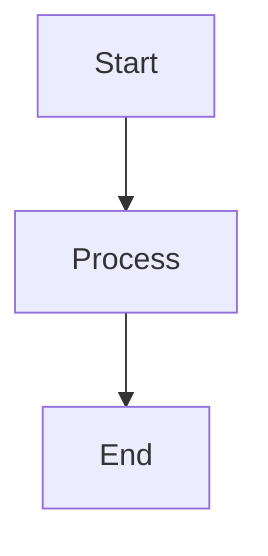
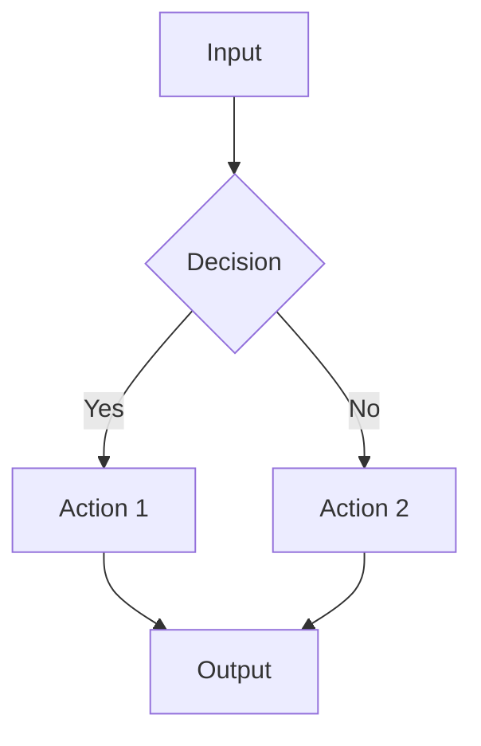
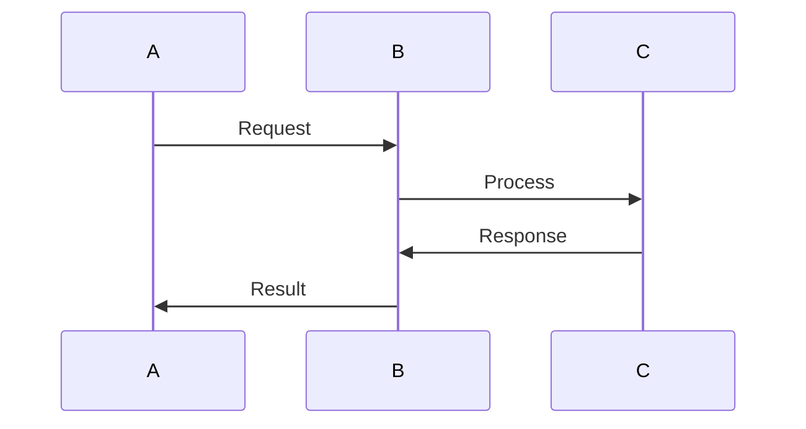

# 📱 Dev.to Publishing Guide

Complete guide for converting Jekyll blog posts to dev.to format with proper formatting, image hosting, and deployment validation.

## 📁 File Organization Structure

### **CRITICAL**: Directory Structure for Content Creation

When creating dev.to articles, **ALWAYS** use the correct directory structure:

#### Dev.to Articles

```
docs/devto/
├── articles/                             ← FINAL articles go here
│   ├── 2025-08-27-article-title.md      ← Published articles
│   └── ...
├── working/                              ← Draft articles in progress
├── templates/                            ← Article templates
└── publishing-guide.md                   ← This guide
```

#### File Naming Conventions

**Published Articles**: `YYYY-MM-DD-article-title.md` (in `articles/` folder)
**Draft Articles**: `YYYY-MM-DD-article-title-draft.md` (in `working/` folder)

#### Creation Workflow

1. **Create draft** in `docs/devto/working/`
2. **Develop content** with proper formatting
3. **Move to `articles/`** when ready for publication
4. **Create LinkedIn post** in `docs/linkedin/posts/`

---

## 🎯 Overview

This guide covers the complete workflow for publishing Jekyll blog posts to dev.to while maintaining:

- ✅ **Educational quality** and technical accuracy
- ✅ **Image hosting** on `docs.worldleadersgame.co.uk`
- ✅ **Dev.to compatibility** with ASCII diagrams
- ✅ **Community engagement** optimization
- ✅ **SEO and discoverability** best practices

## 📋 Pre-Publishing Checklist

### Content Validation

- [ ] **Educational Value**: Clear learning objectives for readers
- [ ] **Technical Accuracy**: All code examples tested and functional
- [ ] **Age-Appropriate**: Content suitable for professional development community
- [ ] **Original Content**: No copyright violations or plagiarism
- [ ] **Complete Article**: Introduction, body, conclusion, and call-to-action

### Dev.to Technical Requirements

- [ ] **Frontmatter Format**: Proper YAML frontmatter with required fields
- [ ] **Tag Compliance**: Maximum 4 tags, following dev.to conventions
- [ ] **Image URLs**: All images hosted on `docs.worldleadersgame.co.uk`
- [ ] **Diagram Format**: ASCII/Unicode diagrams (no Mermaid)
- [ ] **Link Validation**: All internal links converted to external URLs
- [ ] **Markdown Compatibility**: Dev.to markdown syntax compliance

### ⚠️ CRITICAL: Diagram Requirements

**Dev.to DOES NOT support Mermaid diagrams.** All `mermaid` code blocks will display as plain text code, breaking the article layout.

**Required Actions:**

- ✅ Convert ALL Mermaid diagrams to ASCII format
- ✅ Use tables for complex data relationships
- ✅ Replace complex diagrams with numbered processes
- ✅ Test diagram rendering in dev.to preview

**Conversion Priority:**

1. **High Impact**: Main workflow diagrams → ASCII
2. **Medium Impact**: Data relationships → Tables
3. **Low Impact**: Complex flows → Numbered lists

### Engagement Optimization

- [ ] **Compelling Title**: Clear value proposition under 50 characters
- [ ] **TL;DR Section**: Engaging summary with key takeaways
- [ ] **Discussion Questions**: 3-5 questions to encourage comments
- [ ] **Call-to-Action**: Clear next steps for readers
- [ ] **Series Attribution**: Proper series linking if applicable

## 🔄 Conversion Workflow

### Step 1: Content Preparation

```bash
# Copy Jekyll post to working directory
cp _posts/YYYY-MM-DD-article-title.md devto/working/
```

**Note**: Completed articles should be saved to `devto/articles/` folder for organization and future reference.

### Step 2: Frontmatter Conversion

**From Jekyll:**

```yaml
---
layout: post
title: "Article Title"
date: 2025-08-02
categories: ["development", "ai", "education"]
tags: ["specific", "technical", "tags"]
author: "Victor Saly"
---
```

**To Dev.to:**

```yaml
---
title: "Article Title"
published: false
description: "Brief, engaging description for dev.to feed (under 160 chars)"
tags: ai, education, gamedev, softwaredevelopment
cover_image: https://docs.worldleadersgame.co.uk/assets/linkedin-images/article-cover.png
canonical_url: https://docs.worldleadersgame.co.uk/post/article-slug/
series: "AI-First Educational Game Development"
---
```

### Step 3: Image URL Conversion

**Pattern Replacement:**

```bash
# Replace relative image URLs
sed -i 's|/assets/images/|https://docs.worldleadersgame.co.uk/assets/images/|g'
sed -i 's|

**⚠️ Dev.to DOES NOT support Mermaid diagrams** - All diagrams must be converted to ASCII/Unicode format.

**Common Diagram Types to Convert:**

#### 4.1: Simple Flowcharts

**Before (Mermaid):**



**After (ASCII):**

```
┌─────────┐
│  Start  │
└────┬────┘
     │
     ▼
┌─────────┐
│ Process │
└────┬────┘
     │
     ▼
┌─────────┐
│   End   │
└─────────┘
```

#### 4.2: Complex Workflows

**Before (Mermaid):**



**After (ASCII):**

```
┌─────────┐
│  Input  │
└────┬────┘
     │
     ▼
    ┌───┐
    │ ? │ Decision
    └─┬─┘
   ┌──┴──┐
   │ Yes │ No
   ▼     ▼
┌────────┐ ┌────────┐
│Action 1│ │Action 2│
└───┬────┘ └───┬────┘
    │          │
    └────┬─────┘
         ▼
    ┌─────────┐
    │ Output  │
    └─────────┘
```

#### 4.3: Sequence Diagrams

**Before (Mermaid):**



**After (ASCII):**

```
    A        B        C
    │        │        │
    │Request │        │
    ├────────►        │
    │        │Process │
    │        ├────────►
    │        │Response│
    │        ◄────────┤
    │ Result │        │
    ◄────────┤        │
    │        │        │
```

#### 4.4: Table-Based Alternatives

For complex diagrams, consider using tables instead:

```markdown
| Stage             | AI Autonomy | Human Input            | Time Saved |
| ----------------- | ----------- | ---------------------- | ---------- |
| Issue Creation    | 90%         | Educational validation | 80%        |
| Code Generation   | 95%         | Architecture review    | 85%        |
| Safety Validation | 85%         | Final safety check     | 70%        |
```

#### 4.5: Numbered List Process

Complex workflows can be simplified to numbered steps:

```markdown
## The 7-Step AI Development Process

1. **🎙️ Voice Memo/Idea** → Input educational concept
2. **🤖 AI Analysis** → Extract requirements and context
3. **📋 AI Issue Generation** → Create detailed GitHub issues
4. **👨‍💻 Copilot Agent** → Automated implementation
5. **🛡️ Safety Pipeline** → Multi-layer content validation
6. **👨‍🎓 Human Review** → Educational effectiveness validation
7. **🔄 Learning Loop** → Continuous improvement feedback
```

### Step 5: Content Optimization

#### Add TL;DR Section

```markdown
> **TL;DR**: Brief, engaging summary with key value proposition and main takeaways that encourage continued reading.
```

#### Include Real GitHub Examples and Proven Data

For articles discussing project management, issues, or development processes, include links to actual implementations:

```markdown
## Real Implementation Examples

**Live GitHub Issues**: [Closed Issues](https://github.com/victorsaly/WorldLeadersGame/issues?q=is%3Aissue%20state%3Aclosed&page=1) - See resolved issues demonstrating the methodology in action

**Project Milestones**: [Active Milestones](https://github.com/victorsaly/WorldLeadersGame/milestones) - Track progress and completion of systematic planning

**Detailed Documentation**: [Complete Issue Analysis](https://docs.worldleadersgame.co.uk/issues/) - In-depth review of generated issues and outcomes
```

**Benefits of Including Real Examples**:

- ✅ **Credibility**: Readers can verify claims with actual data
- ✅ **Learning**: Concrete examples they can study and replicate
- ✅ **Transparency**: Open development process builds trust
- ✅ **Follow-up**: Detailed documentation for deeper learning

#### Add Discussion Questions

```markdown
## 💭 Discussion Questions

I'm curious about your experience with [topic]:

1. **What's your experience with [specific aspect]?**
2. **Have you tried [specific technique/approach]?**
3. **What barriers have you encountered when [doing something]?**
4. **How do you balance [competing concerns]?**

Share your thoughts and experiences in the comments below! 👇
```

#### Add Resource Links

```markdown
## 🔗 Want to Learn More?

This post is part of our **[series name]**.

**📚 Follow the complete journey**: [docs.worldleadersgame.co.uk](https://docs.worldleadersgame.co.uk/)
**💻 Browse the code**: [GitHub repository](https://github.com/victorsaly/WorldLeadersGame)
**🤖 Study the methodology**: [Complete instruction system](https://github.com/victorsaly/WorldLeadersGame/tree/main/.github/copilot-instructions)

### Include Proven Data and Real Examples

For articles about development processes, include links to actual implementations:

**🎯 See it in action**: [Closed GitHub Issues](https://github.com/victorsaly/WorldLeadersGame/issues?q=is%3Aissue%20state%3Aclosed&page=1) - Resolved issues proving the methodology works
**📊 Track progress**: [Project Milestones](https://github.com/victorsaly/WorldLeadersGame/milestones) - Live project management in action  
**📖 Deep dive**: [Detailed Issue Analysis](https://docs.worldleadersgame.co.uk/issues/) - Complete documentation and outcomes

**Next week**: [Preview of upcoming content]

---

_Follow me [@victorsaly](https://dev.to/victorsaly) for more insights on [topic area]._
```

## 🎨 Dev.to Formatting Best Practices

### Headers and Structure

```markdown
# Main Title (H1) - Only one per article

## Section Headers (H2) - Primary sections

### Subsection Headers (H3) - Within sections

#### Detail Headers (H4) - Rarely needed
```

### Code Formatting

````markdown
`Inline code` for short snippets

```language
Multi-line code blocks
with proper syntax highlighting
```
````

> Quote blocks for important insights

````

### Visual Elements
```markdown
**Bold text** for emphasis
*Italic text* for subtle emphasis
~~Strikethrough~~ for corrections

- Bullet points for lists
1. Numbered lists for sequences

🎯 Emojis for visual appeal and categorization
````

### Links and References

```markdown
[Link text](https://full-url.com) - Always use full URLs
[Internal content](https://docs.worldleadersgame.co.uk/path) - Convert internal links
```

## 🔍 Quality Assurance

### File Organization

- [ ] **Completed Articles**: Saved to `devto/articles/` folder for reference
- [ ] **Working Drafts**: Keep in `devto/working/` during development
- [ ] **Published Articles**: Move to `devto/articles/` after publication
- [ ] **Proper Naming**: Use consistent `YYYY-MM-DD-title-devto.md` format

### Content Review

- [ ] **Readability**: Clear, engaging writing style
- [ ] **Flow**: Logical progression of ideas
- [ ] **Value**: Actionable insights and takeaways
- [ ] **Examples**: Concrete examples and code snippets
- [ ] **Accuracy**: Technical information verified

### Technical Validation

- [ ] **Markdown Syntax**: Proper formatting throughout
- [ ] **Link Testing**: All links functional and correct
- [ ] **Image Loading**: All images accessible and optimized
- [ ] **Code Testing**: All code examples functional
- [ ] **Mobile Friendly**: Content readable on mobile devices

### SEO and Discoverability

- [ ] **Title Optimization**: Clear, searchable title
- [ ] **Tag Relevance**: Tags match content and dev.to conventions
- [ ] **Description**: Compelling meta description
- [ ] **Canonical URL**: Proper attribution to original source
- [ ] **Series Attribution**: Proper linking to related content

## 📊 Dev.to Tag Guidelines

### Recommended Tags

- **ai** - AI and machine learning content
- **education** - Educational technology and learning
- **gamedev** - Game development content
- **softwaredevelopment** - General software development
- **github** - GitHub and collaboration tools
- **productivity** - Development productivity and tools
- **tutorial** - Step-by-step guides
- **webdev** - Web development content

### Tag Best Practices

- Maximum 4 tags per article
- Use popular, established tags for discoverability
- Combine broad and specific tags
- Check tag popularity before using

## 🚀 Publishing Workflow

### 1. Final Review

```bash
# Run validation script
./devto/validate-devto-article.sh devto/articles/article-name.md
```

### 2. Test Locally

```bash
# Preview in Jekyll (if needed)
bundle exec jekyll serve --baseurl "" --drafts
```

### 3. Pre-Publish

```yaml
# Set in frontmatter
published: false # For draft mode
```

### 4. Publish

```yaml
# Set in frontmatter
published: true # When ready to go live
```

### 5. Post-Publish

- [ ] **Share on Social**: Twitter, LinkedIn, etc.
- [ ] **Monitor Engagement**: Respond to comments
- [ ] **Track Analytics**: Views, engagement metrics
- [ ] **Update Series**: Link to new content in series

## 🛠️ Automation Tools

### convert-to-devto.sh

Automated conversion script handling:

- Frontmatter transformation
- Image URL conversion
- Diagram format conversion
- Content optimization

### validate-devto-article.sh

Quality assurance script checking:

- Frontmatter compliance
- Image accessibility
- Link validation
- Formatting compliance

## 📚 Examples and Templates

### Sample Frontmatter

```yaml
---
title: "AI-First Development: Achieving 95% Autonomous Code Generation"
published: false
description: "Two weeks into our AI-first development experiment, we've discovered the specific methodologies that enable true autonomous software creation."
tags: ai, education, gamedev, softwaredevelopment
cover_image: https://docs.worldleadersgame.co.uk/assets/linkedin-images/ai-first-development.png
canonical_url: https://docs.worldleadersgame.co.uk/post/ai-first-development-methodology/
series: "AI-First Educational Game Development"
---
```

### Sample Diagram Conversion

```
# Progress Bar Visualization
Architecture Design      ████████████████████ 95% ✅
Code Generation         ████████████████████ 92% ✅
Documentation          ████████████████████ 100% 🎯
Educational Content     ████████████████░░░░ 85% ⭐
```

### Sample Discussion Section

```markdown
## 💭 Discussion Questions

I'm curious about your experience with AI-assisted development:

1. **What's the highest level of AI autonomy you've achieved in your projects?**
2. **Have you tried giving AI more strategic decision-making power?**
3. **What barriers have you encountered when increasing AI autonomy?**
4. **For educational/child-focused projects, how do you balance AI efficiency with safety requirements?**

Share your thoughts and experiences in the comments below! 👇
```

### Including Real Data and Proven Examples

When writing about development methodologies or project management:

```markdown
## Real Implementation Proof

**Live Examples**: [Closed GitHub Issues](https://github.com/victorsaly/WorldLeadersGame/issues?q=is%3Aissue%20state%3Aclosed&page=1) - See the methodology working in practice

**Project Progress**: [Milestones](https://github.com/victorsaly/WorldLeadersGame/milestones) - Track actual implementation timelines

**Detailed Analysis**: [Issue Documentation](https://docs.worldleadersgame.co.uk/issues/) - Complete breakdown of generated issues and outcomes

This transparency allows readers to:

- Verify claims with actual data
- Study concrete implementation examples
- Track progress and results over time
- Access detailed documentation for replication
```

## 🔄 Continuous Improvement

### Performance Tracking

- Monitor article performance metrics
- Analyze reader engagement patterns
- Identify successful content formats
- Optimize based on community feedback

### Process Refinement

- Update templates based on dev.to changes
- Improve automation scripts
- Enhance quality assurance procedures
- Streamline conversion workflow

---

**Remember**: The goal is to share valuable educational content while building a community around AI-assisted educational development. Quality and authenticity are more important than speed.
