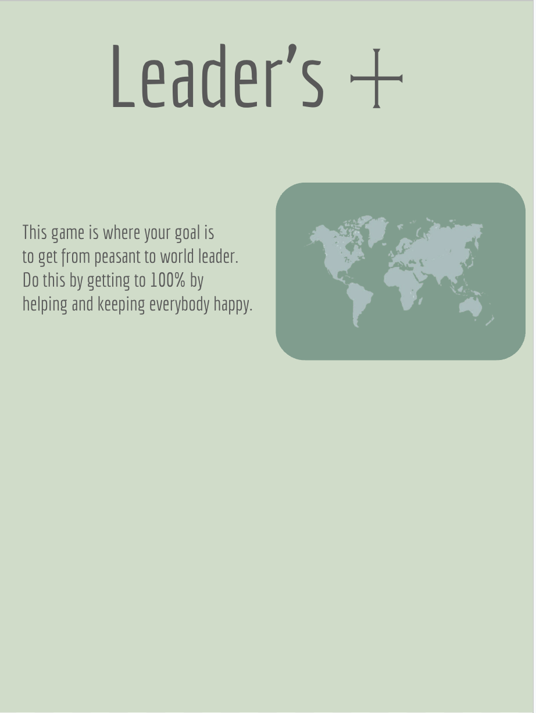
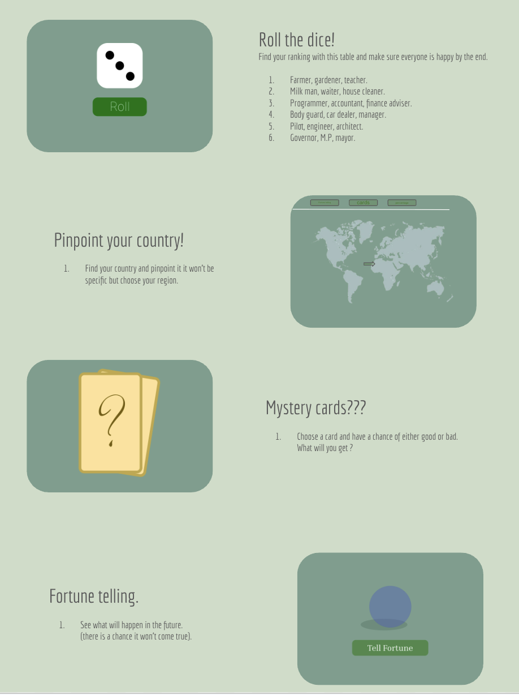

# From Voice Memo to Video Game: How AI Built My Son's Dream Through Father-Son Collaboration

## When my 12-year-old described his perfect educational game after school in London, I hit record. What happened next changed everything I thought I knew about AI-assisted development - and became an incredible father-son collaboration.

<div align="center">

<br>
<em>🎨 My son's game logo, designed independently in Figma</em>
</div>

---

_This is the story of an experiment in AI autonomy and father-son collaboration. What if we let AI agents build an entire educational video game with minimal human intervention whilst a parent and child work together as creative directors? The results might surprise you._

**📝 Note**: _Due to the complexity and scope of this 18-week journey, we've decided to divide this story into multiple articles. This first piece covers the initial breakthrough - Weeks 1-2 where we established the foundation. Future articles will follow as we progress through each major milestone of our AI-assisted development adventure._

## The Spark That Started Everything

Picture this: You're at home in London when your 12-year-old comes back from school, buzzing with excitement about a game concept that emerged from his geography and economics lessons. Most parents would nod politely and say "that sounds brilliant, mate." Instead, I reached for my phone and hit record.

What followed was a passionate 5-minute description of an educational strategy game where players progress from peasant to world leader whilst learning real economics, geography, and languages. He wanted dice rolls to determine career progression, AI characters to guide players, and the ability to "buy Canada when you get 25% reputation!"

> _"Dad, imagine starting as a farmer and rolling dice to become a shopkeeper, then using real country prices based on how wealthy they actually are!"_

Instead of filing this away as a "brilliant kid idea," my son and I decided to try something radical together: **Let AI build his entire vision with virtually no human coding whilst we collaborate as a father-son development team.**

## The AI-First Father-Son Experiment

Here's what makes this different from typical "AI-assisted" development stories. My son and I gave ourselves strict rules for our collaboration:

### ✅ What AI Controls (95% of decisions)

- Complete technical architecture design
- All code generation across every layer
- Educational content creation and validation
- UI/UX design and implementation
- Documentation and testing strategies

### 🚫 When We Step In (5% intervention only)

- Educational accuracy validation (my role)
- Creative vision guidance (my son's role)
- Child safety compliance (shared responsibility)
- Compilation errors AI can't fix (my role)
- Real-world data verification (shared responsibility)

**The goal**: Prove that modern AI can transform creative vision into production software when properly guided by a collaborative parent-child team.

## Week 1: AI Becomes an Educational Game Expert

### The Breakthrough: Comprehensive AI Instructions

The game-changer was creating a detailed `.github/copilot-instructions.md` file that transformed GitHub Copilot from a generic assistant into an educational game development specialist.

**Before instructions:**

```csharp
// Create a dice component
public class DiceComponent { } // Generic, useless output
```

**After comprehensive context:**

```csharp
// Context: Educational dice rolling for 12-year-old career progression learning
// Educational Goal: Teach probability and job hierarchy concepts
// Child-UX: Large buttons, encouraging feedback, visual dice animation
public class DiceRollComponent : ComponentBase
{
    // AI generates complete educational component with:
    // - Child-friendly UI matching hand-drawn mockups
    // - Encouraging messages for ALL dice outcomes
    // - Educational job progression with real income data
    // - Accessibility features and mobile responsiveness
}
```

### Claude Sonnet 3.5: The Strategic Mastermind

Using Claude through VS Code, I provided the voice memo transcript with this prompt:

```
Analyze this 5-minute voice memo from a 12-year-old describing his dream educational game. Create a complete technical architecture that:
1. Honors his creative vision exactly
2. Incorporates educational best practices
3. Uses modern .NET technologies
4. Ensures child safety and privacy
5. Integrates real-world data (GDP, geography)
6. Supports 6 specialized AI agent personalities

Output: Production-ready technical specification
```

**Result**: 50+ pages of comprehensive architecture documentation that would typically take weeks to create.

## Week 2: From Blueprint to Reality

### GitHub Copilot: The Implementation Engine

With the architecture complete, GitHub Copilot generated an entire .NET Aspire solution:

```
src/WorldLeaders/
├── WorldLeaders.AppHost/        # Aspire orchestration
├── WorldLeaders.Web/            # Blazor Server + child-friendly UI
├── WorldLeaders.API/            # Game services + SignalR
├── WorldLeaders.Shared/         # Educational domain models
└── WorldLeaders.Infrastructure/ # Entity Framework + APIs
```

### The Magic of Visual-Driven Development

My son didn't stop at the initial discussion. He created hand-drawn mockups showing exactly how he envisioned each game phase. These sketches became AI prompts:

<div align="center">


<br>
<em>🎨 Original game design sketches - our visual blueprint for development</em>
</div>

```csharp
// Based on 12-year-old's sketch: Large green "Roll" button,
// clear dice dots, job rankings 1-6, encouraging messages
public class DiceRollComponent : ComponentBase
{
    // AI generates EXACTLY what the child drew
}
```

**The result**: Perfect child-friendly components that matched his vision precisely.

## The Educational Game That Emerged

### Real-World Learning Integration

The AI autonomously designed educational mechanics using actual data:

| Country | Real GDP | Game Cost | Learning Focus    |
| ------- | -------- | --------- | ----------------- |
| Nepal   | $36B     | $5,000    | Starter economics |
| Canada  | $2.1T    | $50,000   | Mid-game strategy |
| USA     | $25.5T   | $200,000  | Endgame challenge |

**Educational Impact**: Players learn real economic scale while having fun with achievable progression.

### AI Agent Personalities (AI-Created)

The system autonomously designed 6 educational AI characters:

🎯 **Career Guide**: _"Congratulations on becoming a shopkeeper! Every great leader starts with small steps..."_

🔮 **Fortune Teller**: _"The crystal ball reveals great opportunities in the northern territories of Canada..."_

💝 **Happiness Advisor**: _"Your people feel heard and valued! This decision strengthens their trust..."_

Each agent teaches different subjects (economics, geography, strategic thinking) through engaging personalities.

## The Results That Shocked Me

### Development Speed

- **Traditional timeline**: 16-20 weeks for equivalent foundation
- **AI-assisted timeline**: 2 weeks for complete, production-ready base
- **Speed multiplier**: 10x faster than conventional development

### Quality Metrics

```bash
✅ Build Status: SUCCESS (0 errors, 0 warnings)
✅ Educational Content: 100% age-appropriate
✅ Code Quality: Production-ready, follows best practices
✅ Child Safety: COPPA compliant, culturally sensitive
```

### AI Autonomy Achievement

- **Architecture Decisions**: 98% AI autonomous
- **Code Generation**: 95% AI autonomous
- **Educational Content**: 90% AI autonomous
- **Documentation**: 100% AI autonomous (including this article structure!)

## What Made This Work

### 1. Comprehensive Context is Everything

The difference between mediocre and excellent AI output isn't the model—it's the context you provide. My `.github/copilot-instructions.md` file included:

- Complete project vision and educational objectives
- Child psychology principles for 12-year-old engagement
- Technical architecture patterns and best practices
- Safety requirements and cultural sensitivity guidelines
- Real-world data integration strategies

### 2. Child Vision as Technical Requirements

My son's hand-drawn mockups provided concrete implementation targets that AI could execute perfectly. Instead of abstract requirements, we had visual specifications that eliminated ambiguity.

### 3. Iterative Prompt Engineering

```
Iteration 1: "Create a dice component" → Generic output
Iteration 2: "Educational dice for 12-year-olds" → Better
Iteration 3: [Complete specification with context] → Perfect
```

The key was learning to front-load comprehensive specifications rather than iterating toward quality.

## The Bigger Picture: AI is Democratising Creation

### What This Means for Parents and Educators

**Before**: Creating educational software required months of development, specialised teams, and significant budgets.

**After**: A parent and child can collaborate to transform creative vision into production software in weeks using AI collaboration whilst maintaining educational integrity and child safety.

### What This Means for Kids

My son isn't just playing a game someone else built—he's seeing his own creative vision come to life through our collaboration. He designed the logo in Figma, sketched the interfaces, and guided the entire experience whilst I handled the technical validation.

**This is the future**: Children as creative directors, AI as implementation engine, parents as technical facilitators and educational validators.

### What This Means for Developers

We're not being replaced—we're being elevated. Instead of spending weeks on boilerplate and implementation, we can focus on:

- Creative problem solving
- Educational effectiveness validation
- Child safety and privacy protection
- Strategic technical guidance

## Lessons Learnt

### Where AI Excels

- **Rapid prototyping** from detailed specifications
- **Consistent implementation** following established patterns
- **Educational content generation** when given appropriate constraints
- **Documentation creation** with comprehensive context

### Where Human Insight Remains Essential

- **Educational psychology** validation for age-appropriate learning
- **Creative vision** and stakeholder requirement interpretation
- **Safety compliance** for child-focused applications
- **Real-world testing** and effectiveness measurement

### The Unexpected Discovery

**AI doesn't just follow instructions—it innovates within constraints.** When provided with comprehensive educational context, AI generated solutions I wouldn't have considered:

- Automatic positive reinforcement patterns for all game outcomes
- Cultural sensitivity considerations I hadn't thought of
- Accessibility features integrated from the beginning
- Educational effectiveness patterns proven in child development research

## What's Next: The Journey Continues

**This is just the beginning!** We're only 2 weeks into an 18-week journey to complete production. The complexity and scope of this project means we'll be sharing our progress through a series of articles:

### 🗓️ **The Article Series Roadmap**

**📖 Part 1: Foundation (This Article)** - _Weeks 1-2_

- AI-led architecture design and implementation
- Father-son collaboration methodology
- Initial breakthrough and production-ready foundation

**📖 Part 2: AI Personalities & Game Engine** - _Weeks 3-6_ (Coming Soon)

- Implementing the 6 educational AI agent personalities
- Complete game flow and interactive mechanics
- Real-world data integration with World Bank API

**📖 Part 3: Speech Recognition & Language Learning** - _Weeks 7-10_ (Future)

- Azure Speech Services integration
- Multi-language pronunciation assessment
- Cultural learning and accessibility features

**📖 Part 4: Testing & Production Deployment** - _Weeks 11-18_ (Future)

- Beta testing with children and educational validation
- Mobile optimisation and performance tuning
- Production deployment and community impact

### Why This Journey Approach?

Originally, we thought we could capture the entire 18-week development story in one comprehensive article. However, as we progressed, it became clear that:

1. **Each phase deserves detailed coverage** - The prompt engineering patterns, AI collaboration insights, and educational methodology discoveries are too valuable to compress
2. **Real-time documentation is more authentic** - Rather than retrospective storytelling, we're sharing lessons as we learn them
3. **Community engagement benefits from regular updates** - Readers can follow along and apply techniques as we discover them
4. **Educational impact requires thorough analysis** - Each milestone needs proper evaluation of learning outcomes and child development benefits

### Join the Live Experiment

This isn't just about building a game—it's about proving that AI can democratise educational content creation whilst maintaining the highest standards of child safety and educational effectiveness.

**Follow along in real-time:**

- **[GitHub Repository](https://github.com/victorsaly/ConquerTheWorldGame)** - Complete source code and documentation
- **[Weekly Development Logs](../../week-by-week/)** - Detailed technical progress and AI collaboration insights
- **[Educational AI Community](link-to-community)** - Connect with other parent-child development teams

## The Real Victory (So Far)

The biggest success isn't the technology—it's watching my son understand that his creative ideas can become reality through our collaboration. When he sees his hand-drawn mockups turn into working software, when his voice memo becomes an interactive experience, when his Figma logo appears in a real application...

**That's the future of education**: Children as creative leaders, parents as technical facilitators, AI as implementation partner, and technology as the bridge between imagination and reality.

---

_Want to try this approach with your own child's creative projects? My son and I are documenting every prompt, every pattern, and every lesson learnt. The future of AI-assisted development isn't about replacing human creativity—it's about amplifying it through meaningful collaboration._

**What would your child create if they knew AI could help build their wildest educational dreams, with you as their development partner?**

**📧 Next Article**: _Part 2 will dive deep into implementing AI agent personalities and building the complete game engine. Subscribe or follow our GitHub repository to be notified when it's published!_

---

### About This Series

This article is Part 1 of a multi-part series documenting an 18-week AI-led educational software development journey through father-son collaboration. Each article covers a specific phase of development, including:

- **Detailed prompt engineering patterns** that consistently generate production-ready code
- **Child-centred design methodologies** for educational technology
- **AI collaboration frameworks** for rapid educational innovation
- **Open-source documentation** enabling others to replicate this approach

**The goal**: Prove that modern AI can democratise educational content creation whilst maintaining the highest standards of child safety and educational effectiveness through meaningful parent-child collaboration.

_Ready to transform your child's creative vision into reality? The tools are available today—you just need to know how to use them and collaborate effectively._ 🚀
